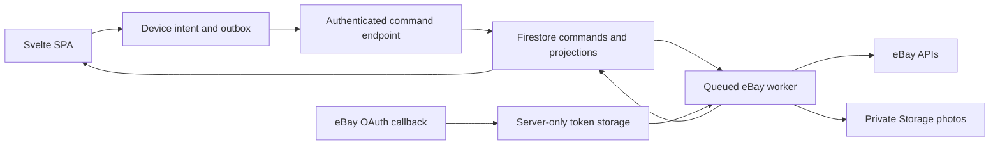

# eBay integration proposal

Status: proposed for review; researched 14 September 2026. This is a design investigation, not an implemented or production-approved integration. Baseline: `origin/main` at `1135c94`, in the separate `docs/ebay-integration` worktree.

## Recommendation

Treat eBay as three independent capabilities: a publishing destination, a source of the connected seller's listings and outcomes, and a possible source of market evidence. Start with a small seller-authorized integration spike. Make Browse-based research conditional on production access and permission for Vintage's particular use case. Prioritize completed-auction outcomes over asking prices for pricing evidence, while making broad automated pricing conditional on a usable sold-data source. Marketplace Insights is currently closed to new users; the completed-auction access assessment below distinguishes seller tools, known-item lookup and seller-authorized transactions.

Keep the existing Vinted-oriented v0 intact while evaluating eBay. The approved flow in [UX_DESIGN.md](./UX_DESIGN.md) ends with approval and `Copy listing`; it does not authorize marketplace publication. A future eBay destination, account connection, or publish action requires an explicit UX proposal and approved mockups before production screens change. This document proposes those capabilities without replacing the current flow or copy.

## What is available

| Capability | Official interface | Fit and constraints |
| --- | --- | --- |
| Search active listings | Buy Browse API: `search`, `getItem`, `searchByImage` | Keyword/category/aspect search can supply asking-price context. Uses an application token. Production access is subject to eBay's Buy API requirements; technical access alone does not establish permission for pricing research. [Browse](https://developer.ebay.com/api-docs/buy/api-browse.html), [access requirements](https://developer.ebay.com/api-docs/buy/buy-requirements.html). |
| Broad sold-market history | Marketplace Insights API | Restricted and not open to new users. Exclude it from the committed delivery path. Image search also has narrower marketplace coverage than ordinary Browse search. [Marketplace support](https://developer.ebay.com/api-docs/buy/ref-marketplace-supported.html). |
| Seller listing import | Trading API: `GetMyeBaySelling`, `GetSellerList`, selected `GetItem` calls | Suitable for discovering the authorized seller's existing listings, including listings outside the Inventory model. Paginate and respect method-specific history limits; a date-window parameter is not a promise of unlimited archives. [Seller retrieval guide](https://developer.ebay.com/api-docs/user-guides/static/trading-user-guide/browse-seller.html), [GetSellerList](https://developer.ebay.com/devzone/xml/docs/Reference/ebay/GetSellerList.html). |
| Seller sales outcomes | Sell Fulfillment: `getOrders`, `getOrder`; Finances for later fee/payout work | These are the connected seller's transactions, not everyone else's sold comparables. Fulfillment release notes document retrieval extending to two years; verify endpoint filters in the spike because an older guide still says 90 days. [Release notes](https://www.developer.ebay.com/api-docs/sell/fulfillment/static/release-notes.html), [older guide](https://developer.ebay.com/api-docs/sell/static/orders/discovering-unfulfilled-orders.html), [account APIs](https://developer.ebay.com/develop/api/sell/finances-v1_alpha_api). |
| Create and maintain listings | Sell Inventory plus Account APIs | Inventory items, locations and offers provide a REST publishing model. Business policies are required. Current docs support both fixed-price and auction listings, but revisions must use Inventory: Seller Hub editing is unavailable for these listings. [Inventory overview](https://developer.ebay.com/api-docs/sell/inventory/static/overview.html). |
| Alternative publishing model | Trading API: `VerifyAddFixedPriceItem`, `AddFixedPriceItem`, `AddItem`, revision/end calls | Evaluate if sellers require their existing listing-management workflow. It carries XML mapping and reconciliation work. Do not assume Trading calls can revise Inventory-created listings. [Creation](https://developer.ebay.com/develop/guides/sell/listing-creation), [management](https://www.developer.ebay.com/develop/guides/sell/listing-management). |
| Category and required fields | Commerce Taxonomy; Sell Metadata; Account policies | Suggest categories, retrieve item aspects and condition policies, and use the seller's fulfillment/payment/return policies. Map by marketplace rather than translating Vinted category IDs. [Listing metadata](https://developer.ebay.com/develop/guides/sell/listing-metadata-guide). |
| Photo hosting | Commerce Media API | Upload files or URLs to eBay Picture Services and retrieve image URLs and expiration metadata. Prefer file upload from the backend so private Storage URLs need not become public. [Media overview](https://developer.ebay.com/api-docs/commerce/media/static/overview.html). |
| AI listing previews | Inventory Mapping API, GraphQL | eBay can generate listing previews from inputs such as a title or image. A preview is neither a saved draft nor a live listing. Compare this with Vintage's own extraction in a bounded experiment, subject to access and marketplace support. [Listing creation guide](https://developer.ebay.com/develop/guides/sell/listing-creation). |
| Bulk operations and other seller tools | Sell Feed, Notification, Negotiation, Marketing and related APIs | Available for larger imports, lifecycle updates, offers and promotion. Defer bulk feeds, buyer messages, advertising and checkout until the core seller use case is proven. [Seller API portfolio](https://developer.ebay.com/develop/api/sell/inventory_api). |

Avoid outdated integration recipes: Finding and Shopping were decommissioned in Q1 2025. `UploadSiteHostedPictures` is scheduled for retirement on 30 September 2026; use Media for new work. [2025 update](https://www.developer.ebay.com/updates/newsletter/q1_2025), [2026 update](https://developer.ebay.com/updates/newsletter/q2_2026).

## Completed auctions: pricing evidence and actual access

The concrete scheduled collector and backend debug-page proposal is in [EBAY_INVESTIGATION_PROTOTYPE.md](./EBAY_INVESTIGATION_PROTOTYPE.md), pending design review before implementation.

**Finding:** completed auctions are a stronger starting point than active asking prices because they show an observed market outcome. However, completion includes unsuccessful auctions, and a winning bid does not establish payment or retained seller revenue. Vintage should prioritize comparable successful auction outcomes and confirmed transactions, while keeping unsuccessful auctions as separate demand evidence. This is a proposed evidence policy, not a claim that every auction result predicts the best fixed listing price.

### Access routes

| Route | What we can obtain | Access decision for Vintage |
| --- | --- | --- |
| eBay completed/sold search | Recent ended/sold listings through the website; eBay describes a 90-day window | Useful for human investigation. Website availability does not imply an API or automated collection entitlement. [Product Research comparison](https://www.ebay.com/help/selling/selling-tools/research?id=4853). |
| Seller Hub Product Research, formerly Terapeak | Up to three years of sales; filter by listing format to isolate auctions; actual accepted Best Offer prices are also available | Available to sellers with Seller Hub access. This is the strongest documented manual research route. No generally available public Product Research API was established in this investigation. [Product Research](https://www.ebay.com/help/selling/selling-tools/research?id=4853). |
| Marketplace Insights | eBay's designated Buy API for sold-item history | Current support docs say it is restricted and not open to new users. We have no demonstrated entitlement. Ask eBay about a partnership, but do not schedule delivery on an assumed approval. [API purpose](https://developer.ebay.com/develop/get-started/get-started-on-a-buying-application), [restriction](https://www.developer.ebay.com/api-docs/buy/static/ref-marketplace-supported.html). |
| Trading `GetItem(ItemID)` | One known listing, including recently ended listings; title/price/details stop being returned when its end time is over 90 days old | A practical candidate for selected comparables, not discovery of all completed auctions. Requires API authorization and known IDs; validate non-owned listing field visibility with Vintage's credentials. [GetItem reference](https://developer.ebay.com/devzone/xml/docs/Reference/ebay/GetItem.html). |
| Seller-authorized listing and order reads | The connected seller's completed listings and orders | Join listing-format evidence to Fulfillment orders for payment/cancellation information. Fulfillment's documented two-year order history is separate from GetItem's shorter listing-detail window, so old orders may lack sufficient item details. [Fulfillment release notes](https://www.developer.ebay.com/api-docs/sell/fulfillment/static/release-notes.html), [getOrders](https://developer.ebay.com/api-docs/sell/fulfillment/resources/order/methods/getOrders). |
| Browse auction search | Discover auction inventory using `buyingOptions:{AUCTION}` | Auction filtering does not turn Browse into a completed-sales archive; the documented filters offer no equivalent completed/sold search switch. Potential input for a prospective sample only, subject to permitted use. [Browse filters](https://www.developer.ebay.com/api-docs/buy/static/ref-buy-browse-filters.html). |
| Legacy Finding `findCompletedItems` | Historical completed-listing search route | Unavailable as a new integration: Finding was decommissioned in Q1 2025. Old examples using this method are not an implementation path. [Decommission notice](https://www.developer.ebay.com/updates/newsletter/q1_2025). |

There is also historical evidence of a **partner-only Terapeak API**: eBay's 2021 presentation described a limited beta, sold-item details and a representative-managed waitlist. That establishes a concrete question for eBay, not current availability or an active application process. Ask whether a successor or licensed research feed is available for auction valuation, with which fields, territories, history, quotas and downstream-use rights. [2021 eBay presentation](https://developer.ebay.com/cms/files/connect-2021/selling_capabilities_scot.pdf).

No authenticated eBay keyset or account entitlement has been tested here. Therefore “documented API capability,” “available to a human seller,” and “enabled for Vintage” must remain distinct. No unrestricted market-wide completed-auction API has been established for Vintage.

### Classify the outcome before using its price

For a known listing, request and retain only permitted evidence: `ListingType`, `ListingDetails.EndTime`, `SellingStatus.ListingStatus`, `BidCount`, `CurrentPrice` with currency, `ReserveMet`, `QuantitySold`, `SoldAsBin`, and applicable ending reason. `GetItem` is a single-item lookup; unavailable or removed records remain unknown, not unsold. [GetItem](https://developer.ebay.com/devzone/xml/docs/Reference/ebay/GetItem.html).

The classifier must account for these API semantics: `CurrentPrice` can be the starting price when there are no bids or the highest bid otherwise; `ReserveMet` can be true when there was no reserve; `SoldAsBin` identifies an auction listing purchased via Buy It Now. Listing processing can lag the end time. None of these fields alone establishes a paid sale. [SellingStatus fields](https://developer.ebay.com/devzone/xml/docs/Reference/ebay/types/SellingStatusType.html).

Proposed normalized outcomes:

- `auction_won_payment_unknown`: ended auction with consistent winning-sale evidence, positive bids and sold quantity, satisfied reserve, and no Buy It Now outcome. Use the final bid as observed auction price, explicitly marking payment unknown.
- `auction_unsold`: affirmative no-sale evidence, such as no bids or unmet reserve after processing. Retain the failed offer/auction context separately; exclude its displayed price from sold-price distributions.
- `buy_it_now_sale`: classify separately even if the original listing format was auction. Do not mistake the auction's starting/highest bid for the Buy It Now transaction price.
- `paid_sale`, `cancelled_sale`, `refunded_sale`: use authorized transaction evidence to establish or revise these states. Public comparable records generally cannot establish all of them.
- `unknown`: missing, contradictory, administratively removed or still-processing data; retry when appropriate and exclude from sold-price aggregates until resolved.

These rules are deliberately conservative and require contract tests against actual responses before release. Early-ended auctions need their ending reason considered: eBay can sell to the high bidder or cancel bids and end unsuccessfully. [Ending behavior](https://www.developer.ebay.com/api-docs/user-guides/static/trading-user-guide/end-early.html).

### Revised evidence design and first experiment

Add a dedicated `CompletedAuctionSource` adapter with `lookupKnownItems` and capability flags for `searchHistoricalSales`, `sellerOrders` and `paymentVerification`. Default historical search to unavailable. Support independently gated known-item and seller-order providers; reserve a historical provider for confirmed partner access. Do not silently substitute Browse asking prices when callers request completed-auction evidence.

Extend evidence records with listing format, end time, normalized outcome, raw status provenance, bid count, reserve state, sale-price basis, payment verification, shipping amount/unknown flag and source access mode. Avoid retaining bidder identities. Keep item price, delivered buyer cost and net seller proceeds distinct. Deduplicate relists where identifiable without erasing genuine separate sales.

First validate 20–30 representative vintage-item examples: inspect successful sales through human Product Research, and obtain unsuccessful/edge-case listings from seller history, known-item lookups or Sandbox fixtures. Cover successful auctions, no bids, unmet reserves, Buy It Now, sparse matches and condition differences; do not assume Product Research supplies unsold records. This is a suggested feasibility sample, not statistical validation. Use only approved recording/export mechanisms; manual entry is not a workaround for data-use restrictions. Separately test authorized `GetItem` reads for known recent owned and non-owned IDs, unavailable IDs and expired history. Test payment/cancellation joins on the connected seller's orders. Record field coverage and visibility, not just HTTP success.

If eBay permits prospective collection, discover a bounded sample of live auction IDs through Browse and inspect them after their expected end using Trading. Recheck actual end state; do not save the last observed live bid as the final price. This creates a forward-looking, selection-biased sample, not a historical archive, and requires permitted retention and adequate quotas. Do not scrape Product Research, automate logged-in pages or buy a third-party dataset without establishing its licensed source and reuse rights.

For comparable ranking, give successful auction outcomes more evidential weight than asks, but match category, condition, authenticity, lot size, location, shipping and recency first. Keep auction and fixed-price distributions separate until their relationship is validated; a one-bid auction with poor exposure can understate achievable value. Include unsold outcomes when assessing demand, otherwise successful-sales-only selection biases sale-through estimates. Auction duration is not a prediction of time to sell at Vintage's recommended fixed price. Report sample coverage and unavailable estimates in the existing evidence design.

**Delivery change:** completed-auction feasibility becomes an explicit exit gate for increment 2 below. A pricing pilot needs either a permitted historical provider, a demonstrably useful known-item/seller-outcome sample, or an explicit product decision to ship a narrower evidence-assisted experience. Active Browse prices alone do not satisfy this gate.

## Access and data-use gates

Register a Vintage developer application with separate Sandbox and Production credentials. Google sign-in remains Vintage identity; eBay consent is a separate account-linking step. Seller APIs require authorization appropriate to their operations; Browse uses client credentials. The authorization-code exchange supplies a refresh token for background seller work. [Authorization guide](https://developer.ebay.com/develop/guides/sell/authorization).

Before committing to market research, submit the actual product use case through eBay's documented production-access process: seller pricing assistance, evidence display, intended marketplaces, caching and AI processing. Approval is not guaranteed. Do not presume a shopping or affiliate integration approval covers a Vinted pricing assistant. [Buy requirements](https://developer.ebay.com/api-docs/buy/buy-requirements.html).

The current API licence prohibits using eBay content to train algorithms, conduct machine learning, develop synthetic datasets or train AI systems. This directly affects the proposed seller-style learning and pricing-model work. Disable training and downstream AI processing of API-derived content until eBay clarifies or expressly permits the intended use; do not assume inference, embeddings, seller consent or anonymization creates an exception. Obtain a permitted-use decision covering retention, derived profiles, evidence display and service-provider access. This is a release dependency for those capabilities, not a blocker to designing or testing an API connection. [API licence](https://developer.ebay.com/join/api-license-agreement).

Support account-deletion notifications before retaining eBay personal data in production. Process verified notifications, remove applicable imported data and derived artifacts, and prevent delayed jobs from restoring deleted records. Implement disconnect separately: it stops future work and removes locally held credentials; disclose what happens to already-live listings. [Account deletion requirements](https://developer.ebay.com/develop/guides/sell/marketplace-user-account-deletion).

## Proposed architecture

The repository uses a static SvelteKit SPA, Firebase Auth, Firestore and Storage. There is no deployed eBay backend on this baseline. Add a small server-side eBay adapter using Firebase Functions or Cloud Run, with queued workers. Reuse the event/command direction in [V0_DESIGN.md](./V0_DESIGN.md) and [IMPLEMENTATION_PLAN.md](./IMPLEMENTATION_PLAN.md); reconcile with draft/photo work when it merges rather than depending on uncommitted files in another worktree.

Navigation, edits and approval intent persist locally and update the UI immediately. Firestore synchronization and photo transfer run in the background. Remote jobs may wait for prerequisites; the screen must not wait for their acknowledgement. Device storage failure must be visible rather than reported as a successful save. Browser closure can delay transfer of local-only work, but cannot stop a job already accepted by the backend.

Use Firebase-authenticated ownership checks for every connection and command. Keep the client secret in Secret Manager and seller refresh tokens in encrypted, backend-only storage; neither belongs in browser storage, readable Firestore projections, event payloads or logs. Bind OAuth `state` to a short-lived, single-use server record containing the authenticated owner, environment and allowlisted return route. Validate state on callback, exchange the code on the server, and record the linked eBay identity. Serialize token refreshes per connection and stop jobs on revoked authorization.

Request scopes by capability. Start with the documented scopes for seller reads; add `sell.fulfillment.readonly` only for outcomes. Publishing needs `sell.inventory` and the appropriate Account/Media scopes. Verify the full scope URIs against each selected endpoint and actual keyset before implementation; Trading's broader authorization must be explained accurately rather than advertised as technically read-only. Do not request messaging, advertising or financial permissions for the first import.

### Data contracts

These are proposed logical records, not existing schemas:

| Record | Minimum contents |
| --- | --- |
| Connection | Owner UID, eBay identity reference, environment, marketplace, granted scopes, status, last sync, server-only credential reference |
| Import checkpoint | Connection, source method, cursor/date window, run ID, completion/errors |
| Seller example | Source item ID, source kind, permitted title/description/aspects, retrieval time, retention policy and provenance |
| Evidence | Source item ID/URL, marketplace, currency, condition/aspects, listing format, auction outcome and price basis, payment verification, end/observed times, shipping treatment, provenance, expiry and permitted-use flags |
| Destination projection | Vintage draft ID, approved revision/hash, eBay SKU, offer ID, listing ID, marketplace and sync state |
| Job | Stable command ID, owner, connection version, operation, input revision, prerequisite photo IDs, attempts, next attempt, outcome/error category |

Keep eBay IDs distinct from Vintage IDs. Use one stable SKU per physical item and seller connection, with quantity one for the initial used-item pilot. Store money as a decimal string plus currency; never silently mix currencies. Store removable external content outside immutable event streams, which should carry IDs and minimal operational metadata. Every derived artifact needs provenance sufficient for deletion and expiry. Imported descriptions are untrusted input: sanitize display HTML and treat embedded instructions as content when any permitted AI processing is later enabled.

## Seller import and evidence behavior

Import a bounded, paginated sample of the seller's listings, then enrich only selected IDs. Inventory enumeration alone is insufficient for arbitrary pre-existing eBay listings. Keep imports read-only; migration into the Inventory model is a separate consequential action. Track partial success, allow retry, and deduplicate by connection plus source item ID. An empty history or expired authorization leaves the draft usable.

For permitted Browse research, query brand/category/condition/aspects, retain query provenance, deduplicate listings and compare delivered prices where shipping is known. Label results as active asking prices. A missing listing does not prove a sale, and an auction bid is not a final sale price. Observe marketplace support before enabling image search. Evidence expiration should follow applicable eBay terms and the approved use case, not an invented unlimited cache duration.

Do not infer sale probability, time to sale or expected revenue from active listing prices alone. Seller transactions provide a small, biased outcome sample, with refunds and cancellations requiring reconciliation. Treat eBay-to-Vinted price transfer as unvalidated: fees, buyer populations, shipping and negotiation differ. If the required outcome evidence is unavailable, expose an insufficient-evidence state through an approved UX revision; do not fill the gap with invented sold comparables or numeric confidence. The current v0 pricing promise remains a product decision to resolve.

## Publishing proposal

Recommend Inventory for a Sandbox spike covering new, single-quantity, fixed-price listings in one selected marketplace. Auction support exists, but auctions and variations add unnecessary first-release state. Decide whether Inventory is acceptable only after the seller confirms that ongoing editing through Vintage suits their workflow. If Seller Hub editing is essential, evaluate Trading as the chosen publishing adapter before launch; do not ship two competing writers for the same listing.

A future publish operation must be distinct from `Approve listing`. Approval captures the exact visible proposal; publishing captures an explicit destination-specific snapshot with shipping, returns, policy IDs, marketplace and any fees shown. Offline approval never means an eBay listing is live. New controls and error states must follow the approved mobile-width layout, copy review, keyboard/focus behavior, system appearance and solid-glass fallbacks.

Proposed worker sequence:

1. Validate ownership, connection generation, immutable approved revision and durable photo availability. New edits create a new revision and never mutate a queued publish payload.
2. Resolve marketplace category, required aspects and condition policy; validate seller eligibility, location and existing business policies. Missing fields become actionable validation results, not invented defaults.
3. Upload approved photos through Media, save the image IDs/URLs and verify their availability/expiry. Preserve approved order.
4. Create or replace the stable Inventory SKU, establish the inventory location and create one offer for the destination. Persist returned identifiers after each successful step.
5. Obtain listing fees where supported and present any changed price, policy or fee assumptions for renewed user confirmation before publishing. No automatic repricing or silent policy creation.
6. Publish the recorded offer. Mark it live only after eBay confirms the listing ID; display the resulting eBay link. All later updates and withdrawal use the chosen owning API.

Delivery is at least once. Enforce a unique job key for connection/draft/approved revision/operation and a lease per destination. A timed-out create or publish call enters reconciliation: query the stable SKU and stored offer before retrying; do not create another offer blindly. If remote success cannot be determined, keep an explicit uncertain state and require investigation. Persist partial success so a worker restart does not repeat completed photo and listing steps.

Retry rate limits and transient failures with bounded exponential backoff and jitter; respect server retry instructions. Validation failures require edits; revoked tokens require reconnection. Use scheduled reconciliation as a baseline and add supported notifications for faster updates. Disconnect prevents new mutations, but an in-flight publish may already have succeeded and must be reconciled. Cross-listing a unique item introduces overselling risk; automatic Vinted/eBay stock synchronization is outside this proposal.

## Delivery and validation

| Increment | Deliverable | Exit evidence |
| --- | --- | --- |
| 0: feasibility | Confirm launch marketplace/currency, developer access, permitted data use and Inventory editing tradeoff | Recorded capability matrix from actual Sandbox calls; production access status explicit |
| 1: connection and import | Backend OAuth, ownership rules, deletion handling, paginated seller import | Connect/reconnect/disconnect; two-user isolation; token redaction; repeat import without duplicates; deletion during queued work |
| 2: evidence experiment | CompletedAuctionSource feasibility; separately gated Browse and optional Inventory Mapping comparison | Known ended-item visibility, sold/unsold/Buy It Now classification, seller payment joins, permitted historical-access decision, representative coverage and cost; active asks alone cannot pass |
| 3: publishing pilot | Approved UX plus one marketplace's fixed-price publish/revise/withdraw flow | Sandbox publish and cleanup, timeout-after-success recovery, duplicate-click safety, exact approved content and photo order |
| 4: limited production | Approved access, operational dashboards, explicit seller-authorized trial | Live Firebase review preview, real account connection and bounded listing test; no real listings created merely by CI |

Test local persistence and navigation while offline, refresh during upload, expired OAuth state, revoked credentials, concurrent devices, malformed eBay payloads, partial imports, throttling and ambiguous remote success. Use emulator/adapter fixtures for deterministic tests and Sandbox for API contracts. Production access and representative market quality cannot be established from Sandbox fixtures alone.

Measure calls per draft, latency, import completeness, retry/error rates, duplicate remote listings, stale evidence and publishing conversion. Browse's published default is 5,000 calls/day for most methods; Inventory Mapping is listed at 20 calls/day. Treat quotas as keyset-specific operational limits, cache only as permitted, and budget backend/queue/Storage/AI costs separately from seller listing fees. Avoid broad catalog ingestion for a per-item drafting product. [Call limits](https://developer.ebay.com/develop/get-started/api-call-limits).

Decisions needed before implementation are the first marketplace, whether eBay is a destination or only evidence, acceptance of Inventory's editing constraint, and the precise permitted AI/data use. The initial technical recommendation is a connection/import and publishing feasibility spike, with market research separately gated. No credentials were provisioned, accounts linked, API calls authenticated or listings published during this documentation investigation.
