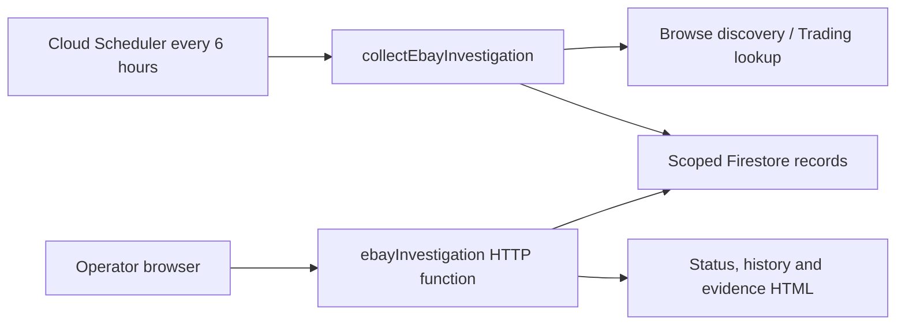

# eBay price investigation prototype

Status: design for review, 14 September 2026. Nothing in this document is implemented or deployed. Companion research: [EBAY_INTEGRATION.md](./EBAY_INTEGRATION.md#completed-auctions-pricing-evidence-and-actual-access).

## The experiment

Run one scheduled Cloud Function that gathers the outcomes of a small cohort of auctions, stores a short price history, and calculates a transparent estimate. A second HTTPS function serves an authenticated debugging webpage showing whether collection works, exactly which auctions support an estimate, and why others were excluded.

The first question is whether we can acquire enough comparable completed-auction observations to make useful pricing conclusions. The prototype estimates a typical observed winning bid for one narrowly defined item cohort. It does not predict net revenue, payment probability, time to sale, or the optimal Vinted price.

Use one operator, one cohort, one marketplace and one currency. Proposed defaults are `EBAY_GB` and GBP; these are experiment choices, not an assertion about the production launch market. The operator supplies the actual item family before the experiment starts: one leaf category, exact brand/model or other identifying attributes, condition IDs, and explicit exclusions for bundles, parts and replicas. Do not begin with all “vintage clothing.” No AI inference, publishing, seller onboarding flow, trained model, message queue or production listing-screen changes are needed.

## The completed-auction access constraint

The scheduled task cannot call an assumed public completed-auction search endpoint. Marketplace Insights is closed to new users. Trading `GetItem` can retrieve a **known** listing, including recent ended listings, but loses listing details more than 90 days after the end. A documented capability still needs validation using our authorized keyset. [Marketplace availability](https://www.developer.ebay.com/api-docs/buy/static/ref-marketplace-supported.html), [GetItem](https://developer.ebay.com/devzone/xml/docs/Reference/ebay/GetItem.html).

Two explicit collection modes share the same collector and estimator:

| Mode | How IDs enter the cohort | What the scheduler collects |
| --- | --- | --- |
| `seeded` — first implementation milestone | Operator provides up to 30 known auction item IDs in deployment configuration, ideally selected before their outcome is known. Recently ended IDs can exercise the historical lookup. | Calls Trading for the known IDs, records outcomes and follows still-active auctions to their end. New seeds require an explicit config revision. |
| `discover` — enable only with usable Browse access | Once daily, fetch one page of up to 50 auctions for the fixed query and admit at most 10 previously unseen matching IDs. | Tracks these IDs and fetches completed outcomes through Trading. This builds history prospectively; it does not backfill the market. |

Browse supports an auction buying-option filter. Use the selected leaf category, query/aspects, location and currency constraints, `buyingOptions:{AUCTION}`, and ending-soonest ordering supported by the endpoint. Save the query and page limit. Only accept single-item lots that meet the deterministic cohort rules; missing required identifying attributes are excluded. [Browse filters](https://www.developer.ebay.com/api-docs/buy/static/ref-buy-browse-filters.html), [discovery guide](https://developer.ebay.com/develop/guides/buy/inventory-discovery-and-refresh-guide).

The webpage must prominently say `Seeded sample` or `Prospective auction sample`. Seeded mode is finite: once all supplied auctions finish, it reports `Awaiting more seeds`, not a continuing market feed. Discovery failures remain visible; never switch modes silently. Broad historical partner access is outside this prototype.

Before real collection, record that the selected API access, retention and arithmetic aggregation are permitted for this use. Existing API-content restrictions still apply without an AI model. Use the approved retention period if shorter than the proposed 30 days. If permission or credentials are unavailable, record `blocked_access` and leave the last valid result visibly dated. Product Research can be used for a permitted human comparison, not scraped as a backend source. [API licence](https://developer.ebay.com/join/api-license-agreement).

## Two functions and a small Firestore namespace

Implement with Firebase Functions v2 in the existing review project's region, after confirming the current Firestore location. Use its existing Firebase Auth Google provider. Keep data under `investigations/{experimentId}` and function names/scheduler jobs specific to the deployed experiment. A Hosting preview is not backend isolation: configure one explicitly selected active experiment, and do not create a new active collector on every PR preview.

`collectEbayInvestigation` uses `onSchedule`; `ebayInvestigation` uses an HTTPS handler with HTML templates. Firebase supports scheduled functions through Cloud Scheduler and HTTP-generated content through Hosting rewrites. Put `/debug/ebay` and `/debug/ebay/**` function rewrites before the existing SPA catch-all. No static asset may shadow these paths. [Scheduled functions](https://firebase.google.com/docs/functions/schedule-functions), [Hosting functions](https://firebase.google.com/docs/hosting/functions).

This is an internal diagnostic page expressly proposed for this investigation, not a new production seller flow. Use plain semantic HTML, readable tables and minimal CSS. The page should work at phone width, follow system appearance, and support keyboard navigation; no glass treatments, mock market data or production dashboard framework are needed. Remove its routes, functions, jobs and temporary data when the experiment is retired, or replace them with a separately reviewed production design.

## Schedule and collection algorithm

Proposed settings, all displayed on the page:

| Setting | Initial value |
| --- | --- |
| Schedule | `0 */6 * * *`, timezone `Etc/UTC`: 00:00, 06:00, 12:00, 18:00 UTC |
| Experiment duration | 14 days, then collection automatically pauses |
| Function timeout / work deadline | 240 seconds / stop starting API requests after 210 seconds |
| Remote request timeout | 8 seconds; sequential requests |
| Work limit | 20 due Trading lookups per run; oldest `nextCheckAt` first, item ID tie-break |
| Discovery | First eligible run of each UTC day; one page, at most 10 new IDs |
| Daily / experiment hard budgets | 90 total eBay HTTP attempts per UTC day and 1,260 per experiment, including token calls and failed attempts |
| Tracking cap | 100 nonterminal items; report cap exclusions |
| History | Most recent 30 days of completed outcomes, subject to permitted retention |

A six-hour schedule is adequate because we need the final outcome, not second-by-second bids. A newly ended item is eligible after `endTime + 15 minutes`, so an ordinary outcome appears by the next scheduled run, usually within 6 hours 15 minutes of ending. Backlog and access failures can extend that; the page reports actual lag.

Each invocation:

1. Read config and eligibility. Use a stable run ID from experiment ID and scheduled time. A retry of a completed run returns without work. Record pause/block states without calling eBay.
2. Acquire a Firestore lease transactionally with a unique attempt token and a five-minute expiry. Only the lease owner can commit work. Record the config hash and code/classifier/estimator versions for the run. Do not rely on `maxInstances: 1` to prevent duplicate delivery; scheduled functions may overlap. [Scheduling behavior](https://firebase.google.com/docs/functions/schedule-functions).
3. Expire evidence past the retention cutoff before calculating anything. In discovery mode, use the daily checkpoint and budgets to discover IDs. Persist each admission idempotently by item ID. In seeded mode, import configured seeds the same way, with `source=seeded`.
4. Read up to 20 due items. For a seed without a known end time, make an initial lookup immediately. For known active items, wait until the end plus grace period; if eBay changes the end time, update `nextCheckAt` accordingly.
5. Before every HTTP attempt, reserve one unit in both the UTC-day and experiment-total budgets transactionally. Never call external APIs inside a Firestore transaction. Refresh tokens only when necessary. A single authentication refresh/retry is allowed if within budget and time; there is no general in-run retry loop.
6. Validate XML with external entities disabled, normalize allowed fields, classify the outcome, and atomically save the observation plus the item's next state. Use `runId/itemId` as the observation identity. Check the lease token on every state-changing transaction. Re-delivery skips completed observations instead of appending duplicates.
7. Read the bounded retained dataset and calculate a summary from explicit observation IDs. Write the immutable run summary and current-summary pointer atomically. Mark the run `complete`, `partial`, `blocked_access` or `failed`; release the lease. A summary from a partial run must retain that label.

Cohort exclusions become terminal immediately and retain their reason; they do not occupy the nonterminal tracking cap. A terminal-looking outcome gets one confirmation lookup at least 24 hours after its first outcome observation. Then stop polling it. If still unresolved, try on later ticks, up to six outcome-check attempts or seven days after the expected end, whichever comes first. Mark remaining ambiguity `unknown`. Temporary remote failure uses a persisted retry time; respect `Retry-After`, otherwise wait for the next tick. Authorization failure blocks further calls for the run; 429 pauses that API for the instructed interval. Malformed payloads are errors, never zero-price results.

A crash leaves completed per-item checkpoints usable. After lease expiry, a later invocation marks the old attempt abandoned and continues due items. A stale worker cannot overwrite a newer lease owner's results. If a budget/deadline/cap prevents full collection, record deferred counts and oldest-due age. Failed collection does not replace an estimate with zero; the page shows the last computed result and its age alongside the failure. Each successful scheduled invocation recalculates after expiry, even if it fetched no new items.

## Outcomes and estimate

Persist the approved subset of item identity, title, category/aspects, condition, listing type, marketplace, currency, start/end time, ending reason, bid count, reserve flag, sold quantity, Buy It Now flag, current price and observation time. Do not retain descriptions, photos, bidder IDs, buyer details, tokens or full XML. Current price is not intrinsically a sale price; an auction with no bids can return its starting price. [Selling status fields](https://developer.ebay.com/devzone/xml/docs/Reference/ebay/types/SellingStatusType.html).

Classify in this order:

1. Still active/processing: `pending`; schedule another lookup.
2. Missing required or contradictory outcome fields, inaccessible item or administrative removal: `unknown`.
3. Buy It Now outcome: `sold_buy_it_now`, excluded from the auction estimator.
4. Affirmative unsuccessful auction: `unsold`, excluded from winning-price statistics.
5. Ended auction with bids, met/no reserve, positive sold quantity, valid positive price and consistent ending reason: `won_payment_unknown`.

Missing optional flags may be interpreted only as documented by the API contract and verified in fixtures; never equate a missing required field with false. An early-ended listing is eligible only if the recorded reason supports a sale to the highest bidder. Winning bids remain payment-unverified: this minimal prototype does not ingest seller orders or infer payment from listing status. First-seen outcomes are provisional; the estimator uses only outcomes confirmed by the follow-up lookup.

For each run, compute a cohort estimate from **one latest confirmed eligible observation per item**, where the end time is within the last 30 days and evidence is unexpired. Require the exact configured cohort, marketplace and GBP currency, single quantity, and `won_payment_unknown`. Exclude unknown/mismatched attributes with a named reason. Use integer pence, no currency conversion. Shipping is displayed separately when known; the estimate is item price only. Do not silently add unknown postage or deduct assumed fees.

The estimator is deliberately deterministic:

- Fewer than five eligible auctions: `insufficient_evidence`; display count and individual outcomes, no headline estimate.
- Five or more: headline = median winning price; displayed spread = 25th–75th percentiles. This is an empirical spread, not a confidence interval.
- Quantiles use sorted pence values and linear interpolation at index `(n - 1) × q`, rounding only the displayed result to the nearest penny. Include minimum, maximum and eligible count.
- No learned weighting, outlier deletion or smoothing. Show extremes for inspection. Cohort corrections require a config revision; do not manually remove an inconvenient cheap result.

Illustrative arithmetic only: five prices £20, £25, £30, £35, £50 give a £30 median and £25–£35 middle-half range. This example is a design test vector, never production evidence.

Also show resolved won/unsold counts and unknown/pending counts. Label `won / (won + unsold)` as **observed cohort success**, not marketplace sell-through; exclude Buy It Now and unresolved cases from that denominator and show all exclusions. Seed selection and ending-soonest discovery are biased. A cohort spanning mixed conditions is a bad estimate even if it has many records.

The “price history” is a table/plot of the median calculated at each completed run, with sample size and window boundaries. A change means the rolling evidence set changed; it is not automatically a market trend. Cohort-config changes start a new experiment ID, keeping histories separate.

## Firestore records

| Path below `investigations/{experimentId}` | Contents |
| --- | --- |
| Root document | Config hash, mode, cohort definition, environment, start/stop times, permission status, enabled flag, total reserved attempts, latest summary ID |
| `control/lease` | Owner attempt token and expiry |
| `budgets/{utcDate}` | Reserved attempts by API, discovery checkpoint, quota/backoff state |
| `items/{legacyItemId}` | Admission source, cohort-match result, end time, next check, attempts, latest observation reference, provisional/confirmed status |
| `observations/{runId_itemId}` | Normalized permitted fields, classification/reasons, fetched/end times, expiry, schema version |
| `runs/{runId}` | Start/finish/heartbeat, version hashes, call counters, processed/deferred/error counts, outcome status, summary and contributing observation IDs |

Index due items by terminal state and `nextCheckAt`, and runs by scheduled time. Keep an upper bound of 500 retained items; stop admissions and display `capacity_reached` if reached. That bounds estimation reads; daily admission limits normally keep the 30-day experiment dataset below it.

Retain item observations, summaries and their contributing IDs for at most 30 days or the shorter permitted period. Query-time expiry checks are mandatory; asynchronous deletion alone is insufficient. Scheduled cleanup removes expired data and invalidates summaries whose inputs are deleted, including relevant personal-data deletion requests. Do not keep aggregates indefinitely by assuming they are exempt. Keep operational counters without source content separately if permitted. The page hides expired summaries even when collection has stopped.

## Backend debugging webpage

One read-only page at `/debug/ebay`, plus a run-detail page at `/debug/ebay/runs/{runId}`. All evidence and calculations are read from Firestore by the HTTPS function and rendered as escaped HTML. Opening or refreshing the page never calls eBay and never starts collection. No browser Firestore client or browser-side estimator.

Proposed page order:

| Section | Exact information to inspect |
| --- | --- |
| Identity and access | Experiment ID, deployed revision, environment (`Sandbox` or `Production`), cohort, seeded/discovery mode and access status |
| Collector health | Enabled/paused/blocked; last attempted and last complete run; next scheduled tick; overdue age; tracked/due counts; daily API budget used |
| Conclusion | `Insufficient evidence` or `Typical observed winning bid: £…`; middle-half range, n, item-price-only basis, payment unknown, last computation time |
| Coverage | Won, unsold, Buy It Now, pending, unknown and excluded counts; discovery-page/admission caps; oldest due item; observed cohort success |
| History | Run time, median, quartiles and n; optional small server-rendered SVG plot with the same accessible table |
| Evidence | Item link/title, end time, price/currency, bids, outcome, provisional/confirmed, inclusion/exclusion reason and fetch time; paginate 50 rows |
| Recent runs | Last 20 runs with state, duration, calls, deferred/error counts and link to normalized details |

A banner says `Collector overdue` when no attempt has started for more than seven hours while enabled. Estimates older than twelve hours say `Stale`; do not hide the timestamp or pretend a page refresh refreshed the evidence. Distinguish `Not yet run`, `Waiting for auctions to end`, `Awaiting confirmation`, `Insufficient evidence`, `Awaiting more seeds`, `Blocked access`, `Partial run` and `Paused after trial`.

Run details show normalized observations and error categories, never raw OAuth/XML payloads. The first page reports summary computation status separately from collection status, so “20 fetched, summary failed” remains diagnosable. Browsing older runs is read-only and has no impact on estimates.

## Authentication and operation

The unauthenticated route serves only a Google sign-in shell. After Firebase sign-in, exchange a recently issued ID token at `/debug/ebay/session` for a short-lived Firebase session cookie. Use the Hosting-compatible cookie name `__session`, `Secure`, `HttpOnly`, `SameSite=Lax`, path `/debug/ebay`, and an eight-hour lifetime. Protect session creation/logout with origin and CSRF checks. Verify cookie validity/revocation and an explicit operator UID allowlist on **every** protected request, including direct function URLs. Serve all diagnostic responses with `Cache-Control: private, no-store`. [Firebase session cookies](https://firebase.google.com/docs/auth/admin/manage-cookies), [Hosting cache behavior](https://firebase.google.com/docs/hosting/manage-cache).

Deny all client Firestore access to investigation records; service accounts read/write server-side. The collector alone reads eBay secrets; the rendering function has no eBay credential access. Use least-privilege service accounts and authenticated Scheduler invocation. Store the application secret and pre-authorized Trading refresh token in Secret Manager. Provision this one investigator connection through an operator setup step; building a general eBay OAuth onboarding UI is outside scope. Revocation produces an actionable blocked status.

Pause/resume and seed/query changes use reviewed deployment configuration or an authenticated operator script, not debug-page mutation controls. Normal debugging waits for the next tick; operators can invoke the existing Scheduler job through cloud IAM when needed, with the same lease and budget. There is no unauthenticated “run now” endpoint. Pausing checks the enabled flag before each request; an already-issued read can finish safely.

After day 14, stop collection automatically. Keep the page available until records expire; scheduled invocations may perform cleanup without external calls. Retire the Scheduler job and temporary services when reviewed conclusions are recorded. No eBay writes or item listings are created by this prototype.

## Review and implementation acceptance

This PR seeks review of the design only. Proposed choices are the six-hour schedule, one narrow GBP cohort, seeded-first collection, optional daily discovery, five confirmed auctions for a median, a 14-day trial and a read-only server-rendered page. Exact cohort/seeds and confirmed API/data-use access are setup inputs before live implementation; the code path must display an honest blocked state until ready.

After design approval, implement in one bounded increment with:

1. Pure classifier/estimator and adapter contract tests: no bids, unmet reserve, Buy It Now, early ending, delayed processing, malformed data, missing attributes, wrong currency, duplicate items, fewer than five results, the arithmetic example and expiry.
2. Emulator tests for duplicate schedules, lease loss, timeout checkpoints, daily budget enforcement, two-operator isolation/denial, session expiry/CSRF and HTML escaping. Page tests prove reading causes no collection and the history reproduces the saved inputs.
3. A live Firebase review preview with real Google operator access and the scoped backend. Sandbox responses demonstrate mechanics and are visibly marked; they cannot establish market usefulness. A separately identified real-data trial must validate permitted known-item access and cohort coverage.
4. A 14-day findings record: access/field coverage, acquired confirmed outcomes, call counts, latency/oldest backlog, exclusions and whether the estimate is useful against permitted human research. Zero qualifying data or denied access is a valid finding, never a synthetic estimate.

At the configured cap, external calls cannot exceed 90/day or 1,260 over 14 days. There are four scheduled time slots daily, each attempt bounded to four minutes; configure automatic Scheduler retries off and recover on the next tick. Duplicate delivery and manual invocations still share the same budgets; Firestore reads and page traffic still incur separate costs. Configure a cloud billing alert and instance/read-page bounds during setup; an alert is not a hard spending cap. Exact charges depend on the selected project/region and current rates, so record an implementation-time estimate rather than promising a fixed monthly price.
