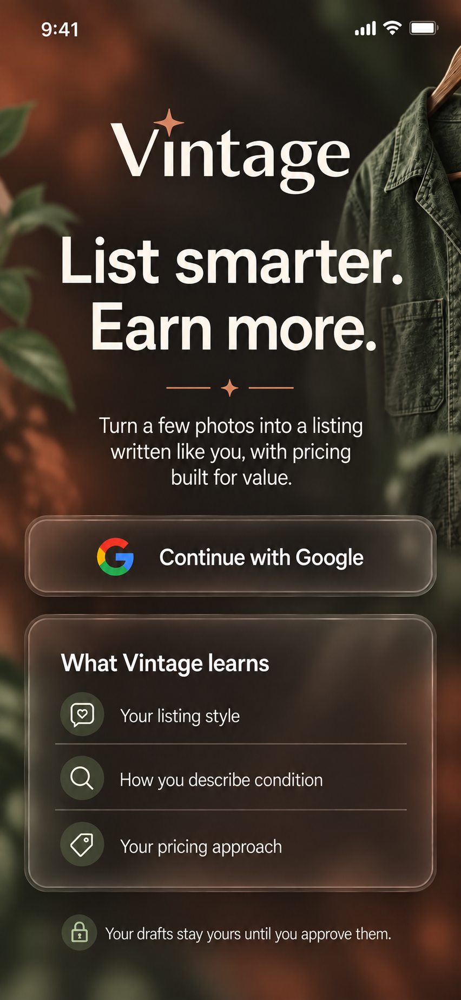
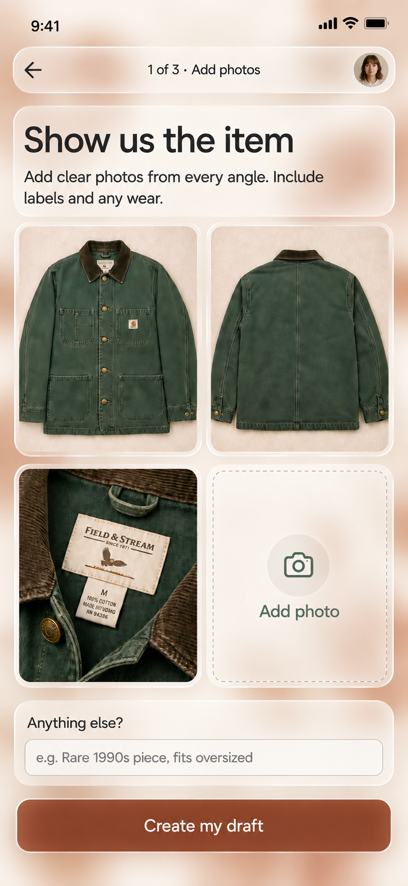
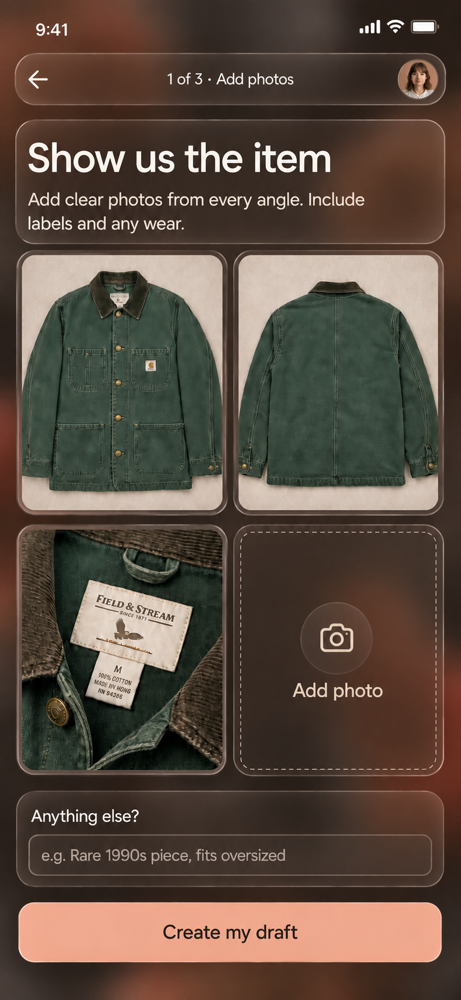
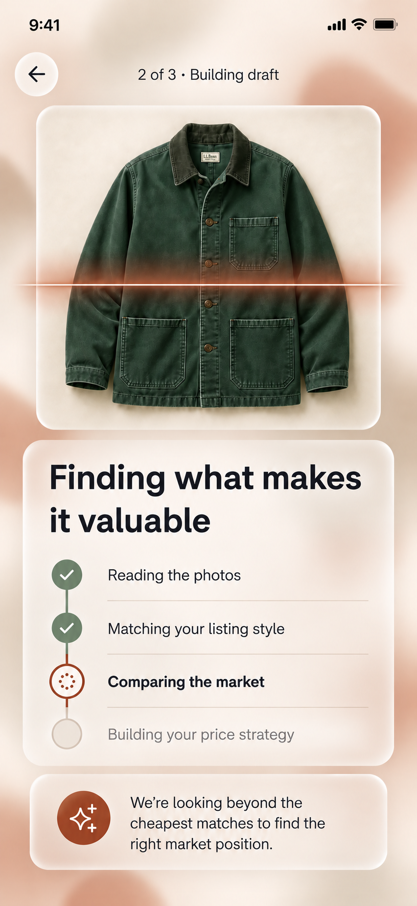
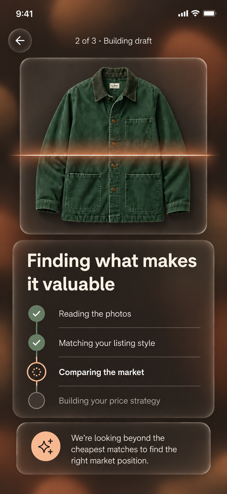
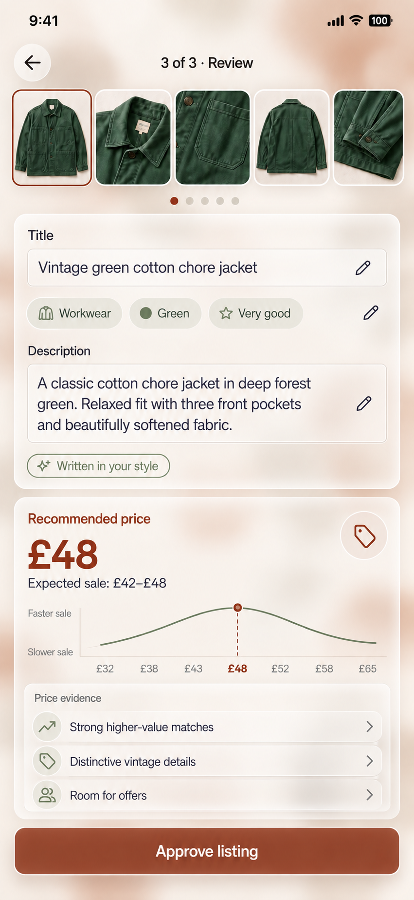
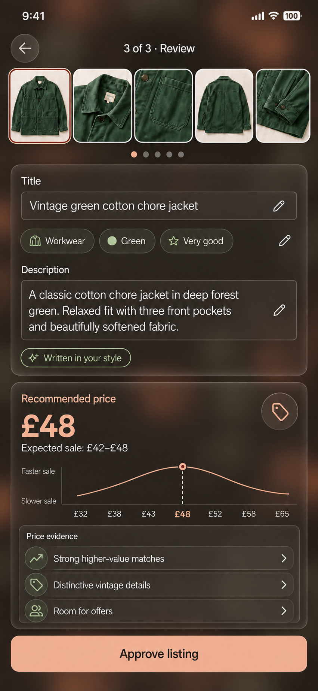

# v0 UX Design

## Experience goal

Vintage turns a handful of item photos into an editable Vinted listing and a revenue-oriented price recommendation. The experience should feel like handing an item to a skilled listing partner: the seller supplies the item, Vintage does the research and drafting, and the seller makes the final call.

The v0 is a mobile-first Svelte SPA designed at a canonical 393 × 852 CSS-pixel viewport. Desktop uses the same focused flow in a centered mobile-width workspace.

## Core flow

```text
Google sign-in
     ↓
Learn from existing listings
     ↓
Add item photos + optional one-line context
     ↓
Analyze photos, seller style, and market position
     ↓
Review and edit listing + pricing recommendation
     ↓
Approve listing
```

Progress is preserved after every meaningful action. Returning to an in-progress listing resumes at the latest state reconstructed from its event stream.

Each screen shows light and dark system appearances at a compact width. Select any mockup to view the full-size image.

## Screen 1: sign in and learn the seller

| Light | Dark |
| --- | --- |
| <a href="./docs/mockups/01-sign-in-light.png"></a> | <a href="./docs/mockups/01-sign-in-dark.png"></a> |

Purpose: establish identity with Google and explain how the seller's listing history improves the result.

The primary action opens Google Account login. After authentication, Vintage creates the user's workspace and imports the existing listing material available to the account. Those listings become style and pricing context for future drafts.

The learning summary sets the expectation that Vintage studies:

- title and description structure;
- vocabulary, tone, formatting, and typical level of detail;
- the seller's treatment of condition and flaws; and
- their historical pricing approach.

The first import has a visible progress state and finishes at the photo screen. Later sessions move directly to the seller's latest in-progress draft or a new-item action.

### States

- Ready: `Continue with Google` is active.
- Authenticating: the button shows progress and remains in place.
- Learning: the screen reports listings found and analyzed.
- Ready to list: the new-item flow opens.
- Recoverable error: the message explains the failed step and offers `Try again`.

## Screen 2: add photos

| Light | Dark |
| --- | --- |
| <a href="./docs/mockups/02-add-photos-light.png"></a> | <a href="./docs/mockups/02-add-photos-dark.png"></a> |

Purpose: gather enough visual evidence for a strong first proposal with minimal typing.

The seller can select files, use the device camera, reorder thumbnails, replace a photo, and remove a photo. The grid encourages complementary views: front, back, label, construction details, and visible wear. Each tile has an accessible name based on position and purpose.

`Anything else?` is an optional single-line input for information beyond the images, such as provenance, fit, fabric feel, or an unpictured detail. `Create my draft` becomes active when at least one image has uploaded successfully.

Upload progress appears on each tile. The CTA reports the aggregate state and advances only when every selected photo is durably stored.

### Interaction details

- File and camera input accept JPEG, PNG, HEIC, and WebP.
- Photos preserve their selected order.
- A photo opens into a full-screen inspection view.
- Reordering uses drag, keyboard move controls, and touch-friendly move actions.
- The browser confirms navigation while uploads are active.
- An interrupted upload can resume from the saved draft.

## Screen 3: build the draft

| Light | Dark |
| --- | --- |
| <a href="./docs/mockups/03-building-draft-light.png"></a> | <a href="./docs/mockups/03-building-draft-dark.png"></a> |

Purpose: make useful work and progress legible while Vintage produces the proposal.

The stage list corresponds to durable generation events:

1. Reading the photos
2. Matching the seller's listing style
3. Comparing the market
4. Building the price strategy

Completed stages remain checked after refresh because the screen is a projection of the listing event stream. The active stage is announced through an `aria-live="polite"` status region. The seller can leave the screen and return while processing continues.

The market message reinforces the pricing objective: determine the item's best market position using the complete relevant price distribution, item differentiation, demand, and negotiation room.

## Screen 4: review, edit, and approve

| Light | Dark |
| --- | --- |
| <a href="./docs/mockups/04-review-light.png"></a> | <a href="./docs/mockups/04-review-dark.png"></a> |

Purpose: let the seller evaluate one coherent proposal and approve it confidently.

The review is a single scrollable form with two clear sections.

### Listing proposal

- Ordered photos
- Editable title
- Editable category, brand, size, colour, material, condition, and other attributes
- Editable description
- Visible markers for inferred fields and uncertain observations
- A `Written in your style` explanation showing which recurring seller patterns shaped the draft

Edits save as the seller works. Field-level undo restores the latest AI proposal. Vintage records the difference between generated and approved content as learning evidence for later drafts.

### Pricing proposal

The recommended listing price is the visual anchor. It is accompanied by:

- an expected sale-price range;
- the relationship between price, expected revenue, and time to sale;
- a seller-adjustable price control;
- evidence supporting premium positioning;
- relevant comparable groups and their price distributions; and
- room reserved for likely offers.

Selecting an evidence row opens a bottom sheet with the underlying comparable group, why it is relevant, its condition and attributes, and its contribution to the recommendation. Changing the price updates the expected range and sale-speed estimate.

`Approve listing` commits the current title, attributes, description, photo order, and chosen price as one approved proposal.

## Approval confirmation

Approval resolves to a compact success state within the review screen. It shows the approved price, confirms that the listing is ready, and provides a primary `Copy listing` action. The approved result remains available in the user's listing history.

## Visual language

The interface uses a terracotta and linen palette with glassmorphic surfaces in both light and dark appearances. Translucent, softly blurred cards sit over restrained terracotta and sand background gradients, with fine edge highlights and subtle shadows. Text, icons, photos, and essential controls remain crisp and opaque.

| Element | Light appearance | Dark appearance |
| --- | --- | --- |
| Canvas | Linen `#F7F0E6` with pale sand and terracotta gradients | Warm charcoal `#211C19` with muted clay and umber glows |
| Glass surfaces | Frosted translucent linen-white | Frosted translucent warm charcoal |
| Text | Warm charcoal `#2B2521` | Linen `#F7F0E6` |
| Primary actions | Rust `#984831` with white text | Soft apricot `#EDB59B` with warm charcoal text |
| Price, selection, and progress accents | Rust `#984831` | Soft apricot `#EDB59B` |
| Evidence and completion | Dark sage | Pale sage |
| Inputs and boundaries | Defined neutral edges and light fills | Visible pale edges and dark fills |

Sage remains a secondary colour for evidence and completion. Decorative glows use clay and sand; photographs retain their natural colours. Palette values are implementation targets, subject to contrast verification on the final composited surfaces.

Both appearances use generous whitespace, an 8-pixel spacing grid, rounded surfaces, highly legible sans-serif type, and item photography whose colours remain unchanged by the theme.

### Follow system appearance

Vintage follows the phone's light/dark system setting automatically from the first render and responds when that setting changes while the app is open. The same behavior applies on desktop. There is no separate in-app theme selection in v0.

Implementation should use the system colour-scheme preference for theme tokens and native controls, including page backgrounds, inputs, dialogs, loading states, errors, and approval confirmation. Switching appearance preserves the current route, draft, entered values, photo order, and focus, without a reload or a flash of the opposite theme.

Glass is decorative: sufficient surface opacity must keep text and control contrast readable over every background. Provide solid surface fallbacks when backdrop blur is unavailable or reduced transparency is requested. The generated mockups illustrate the visual direction; implementation must verify contrast and interaction accessibility in both appearances.

Motion communicates continuity between stages. The reduced-motion experience uses immediate state changes and static progress indicators.

## Accessibility contract

- Every control has a programmatic name and visible focus treatment.
- Touch targets are at least 44 × 44 CSS pixels.
- Text and interactive controls meet WCAG 2.2 AA contrast in both appearances, including over glass surfaces.
- Focus indicators, uncertain fields, errors, and disabled controls remain distinguishable in both appearances.
- The complete flow works with keyboard-only input.
- Validation and generation statuses are announced to assistive technology.
- Colour always has a text or icon counterpart.
- Photo order and AI uncertainty are available as text.
- Zoom and text scaling preserve action access and reading order.

## UX acceptance criteria

- A signed-in seller can reach photo entry immediately.
- A seller can provide photos and optional one-line context as the complete generation input.
- Generation progress survives reload and reports the current stage.
- The draft reflects recognizable patterns from the seller's prior listings.
- Inferred and uncertain content is easy to identify and edit.
- Pricing presents one recommendation, an expected range, and inspectable evidence.
- Approval captures exactly the content and price visible to the seller.
- Every screen follows the system light/dark appearance on first render and when the setting changes, preserving the current draft and focus.
- Both appearances have readable solid-surface fallbacks and are covered by phone and desktop visual checks.
