# v0 UX Design

## Experience goal

Vintage turns a handful of item photos into an editable Vinted listing and a revenue-oriented price recommendation. The experience should feel like handing an item to a skilled listing partner: the seller supplies the item, Vintage does the research and drafting, and the seller makes the final call.

The v0 is a mobile-first Svelte SPA designed at a canonical 393 × 852 CSS-pixel viewport. Desktop uses the same focused flow in a centered mobile-width workspace.

## Screen inventory and delivery status

This document covers full pages, dialogs, native handoffs and recovery states. **Current** means present in the merged app; **planned** means part of the v0 design and implementation plan, with no working screen yet. Planned screens must not be represented by simulated production controls.

| Screen or surface | Entry and exit | Status |
| --- | --- | --- |
| [Sign in](#sign-in) | `/` when signed out, or a protected listing URL; successful root sign-in opens Your listings, while a listing link returns to that item | Current |
| [Google account selection](#native-google-and-camera-handoffs) | Continue with Google opens the provider popup; success or cancellation returns to Vintage | Current, provider-owned |
| [Your listings](#your-listings) | `/` when signed in; New listing opens photo entry, an existing row resumes its item | Current, empty and populated |
| [Add photos and context](#add-photos-and-context) | `/listings/new` creates a locally retained item and replaces the URL with `/listings/{id}`; back returns to Your listings | Current |
| [Photo inspection](#photo-inspection) | Open a thumbnail; close returns to the same photo grid | Current, full-screen dialog |
| [File selection and camera](#native-google-and-camera-handoffs) | Add photo, Use camera or Replace photo; selection returns to the grid | Current, browser/OS-owned |
| [Your account](#your-account) | Avatar in photo entry; close returns to the item, Sign out opens sign-in | Current, dialog |
| [Item unavailable](#item-unavailable) | Missing or inaccessible item URL; Add item starts a new listing | Current |
| [Unknown URL](#unknown-url-and-application-errors) | An unmatched route; currently shows the framework 404 page | Current, default framework page |
| [Restoring, uploading and recovery](#shared-loading-sync-and-error-states) | Inline states within the screen where work is taking place | Current |
| [Seller examples](#seller-examples) | Supply the seller history required for style learning | Planned; input-source interaction still to be agreed |
| [Learning progress](#learning-progress) | Submit examples; completion returns to photo entry | Planned |
| [Build the draft](#build-the-draft) | Create my draft, once its durable inputs are ready; completion opens review | Planned |
| [Review and edit](#review-edit-and-approve) | A completed proposal; opens evidence, approval or returns to listings | Planned |
| [Evidence details](#evidence-details) | An evidence row in review; close returns to the same review position | Planned, bottom sheet |
| [Approval and approved listing](#approval-confirmation-and-approved-listing) | Approve listing; copy the result, return to listings or start another item | Planned |

## Core flow

The implemented flow preserves the intermediate listing screen and starts every new listing with photos, without a naming form:

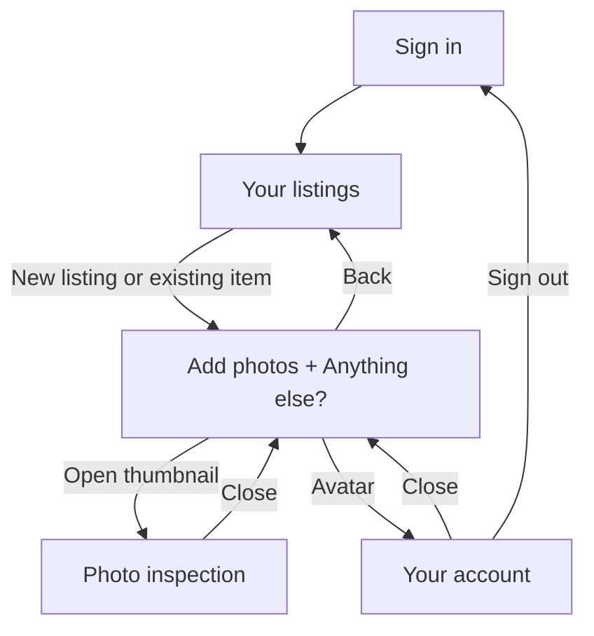


Selecting an existing row resumes that item. A signed-out visitor opening a direct item URL signs in on that URL, then sees the item or Item unavailable. Google account selection and the native camera/file picker are handoffs, not additional Vintage routes.

The remaining product flow is:

```text
Seller examples → Learning progress → Add photos + context
                                            ↓
                                     Create my draft
                                            ↓
                                     Build the draft
                                            ↓
                                     Review and edit ↔ Evidence details
                                            ↓
                                     Approval confirmation
                                            ↓
                                     Your listings / Copy listing / New listing
```

The seller-example entry method remains a milestone 4 design decision; Google authentication does not by itself provide Vinted listing history. It must not silently replace the current Your listings landing screen.

Progress is retained locally after meaningful actions and synced in the background. Editing and navigation do not wait for network acknowledgement. A cloud-dependent generation or approval action, once implemented, must distinguish an outstanding request from confirmed completion while keeping the rest of the interface usable.

## Visual references

The original concept mockups below remain the visual direction for the main journey. Additional images are **captures of the merged app**, documenting the screens and states that were missing. Both sets use compact, clickable light/dark images at 211px; the captures use a 393 × 852 CSS-pixel viewport. [Capture provenance](./docs/screens/README.md) identifies their source and sample data. Planned screens without a dedicated visual are specified in text; they are not claimed to have approved mockups.

## Sign in

| Light | Dark |
| --- | --- |
| <a href="./docs/mockups/01-sign-in-light.png"></a> | <a href="./docs/mockups/01-sign-in-dark.png"></a> |

Purpose: establish identity with Google and explain how the seller's listing history improves the result.

The primary action opens Google Account login. At `/`, successful authentication opens Your listings. On a direct item URL it restores access to that item. Account creation happens in the background; it does not gate navigation on a server acknowledgement.

The sign-in copy describes the intended value of seller-history learning. Importing examples and producing the style profile are planned, not actions the current sign-in screen performs.

The learning summary sets the expectation that Vintage studies:

- title and description structure;
- vocabulary, tone, formatting, and typical level of detail;
- the seller's treatment of condition and flaws; and
- their historical pricing approach.

Returning signed-in sessions at `/` see Your listings. The seller explicitly selects an existing item or New listing.

### States

- Ready: `Continue with Google` is active.
- Authenticating: the button shows progress and remains in place.
- Signed in: open Your listings or restore the item from the requested URL.
- Signed out from an item: show sign-in at the same URL; authenticate before displaying item content.
- Recoverable error: explain the failed sign-in and keep `Continue with Google` available to retry.

## Your listings

**Current — `/` when signed in.** This is the intermediate screen between sign-in and photo entry.

The glass header contains `Your listings` and `Sign out`. The primary `New listing` action opens photo entry directly. There is no naming form or additional setup step.

### Empty listing screen

| Light | Dark |
| --- | --- |
| <a href="./docs/screens/listings-empty-light.png"></a> | <a href="./docs/screens/listings-empty-dark.png"></a> |

The empty state keeps the header and New listing action in place. It does not add promotional copy or sample listings.

### Populated listing screen

| Light | Dark |
| --- | --- |
| <a href="./docs/screens/listings-populated-light.png"></a> | <a href="./docs/screens/listings-populated-dark.png"></a> |

Each glass row opens its item URL. Current rows use labels such as `Listing 1`; these are navigation labels, not seller-entered names. Locally created listings appear while synchronization is pending. Sign out clears the current account's visible listing state and returns to sign-in. Approved-listing access is part of the planned review/approval delivery.

## Add photos and context

| Light | Dark |
| --- | --- |
| <a href="./docs/mockups/02-add-photos-light.png"></a> | <a href="./docs/mockups/02-add-photos-dark.png"></a> |

Purpose: gather enough visual evidence for a strong first proposal with minimal typing.

The seller can select files, use the device camera, reorder thumbnails, replace a photo, and remove a photo. The grid encourages complementary views: front, back, label, construction details, and visible wear. Each tile has an accessible name based on position and purpose.

`Anything else?` is an optional single-line input beneath the grid, for information beyond the images such as provenance, fit, fabric feel or an unpictured detail. It accepts up to 2,000 characters and enqueues changes as the seller types. The header shows `1 of 3 · Add photos`, a back action to Your listings and the account avatar.

The `Create my draft` CTA in the concept mockup is planned. It is not present in the current app because generation is not implemented. When delivered, it can submit only after at least one valid photo and every selected input are durably ready.

Upload progress appears on each tile. The current screen reports saving, uploading, saved or attention-needed state beneath the input. Selecting a photo shows its locally retained preview immediately where the format is browser-readable; HEIC/HEIF shows preparation/upload feedback while its readable preview is produced.

### Interaction details

- File and camera input accept JPEG, PNG, WebP and HEIC/HEIF, up to 8 photos and 10 MB per photo.
- Photos preserve their selected order.
- A photo opens into a full-screen inspection view.
- Reordering uses drag, keyboard move controls, and touch-friendly move actions.
- Back navigation, context editing and additional selections remain usable while syncing. Do not put a network-wait confirmation in front of navigation.
- Upload work continues across app navigation. Reopening an item recovers locally retained bytes after a tab closes; a closed or suspended browser is not promised to keep uploading.
- Cancelling the native picker leaves the existing photos intact. Replacement retains the current position; removing the target while replacement uploads prevents it from reappearing.
- If a stored thumbnail cannot load, its tile offers Try again; the rest of the item remains usable.

### Empty photo entry

| Light | Dark |
| --- | --- |
| <a href="./docs/screens/photos-empty-light.png">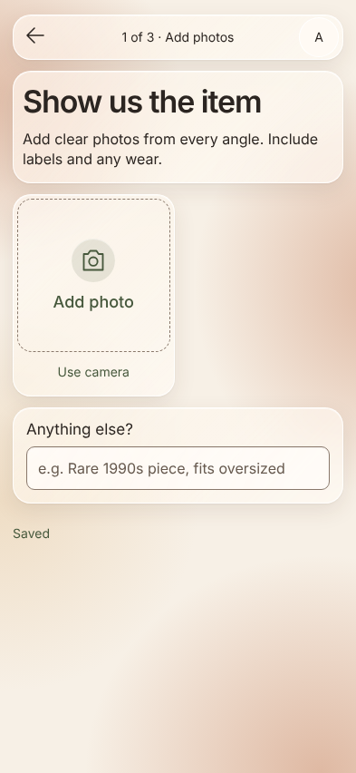</a> | <a href="./docs/screens/photos-empty-dark.png">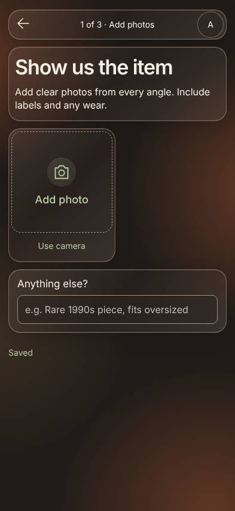</a> |

This is the actual first screen after New listing: Add photo / Use camera plus Anything else?, without prefilled sample photos. The photos in the concept mockup illustrate a later populated state.

## Photo inspection

**Current — full-screen dialog over `/listings/{id}`.** Selecting a loaded thumbnail opens the natural-colour image at a contained size, with `Photo N of M` and a close control.

| Light | Dark |
| --- | --- |
| <a href="./docs/screens/photo-inspection-light.png">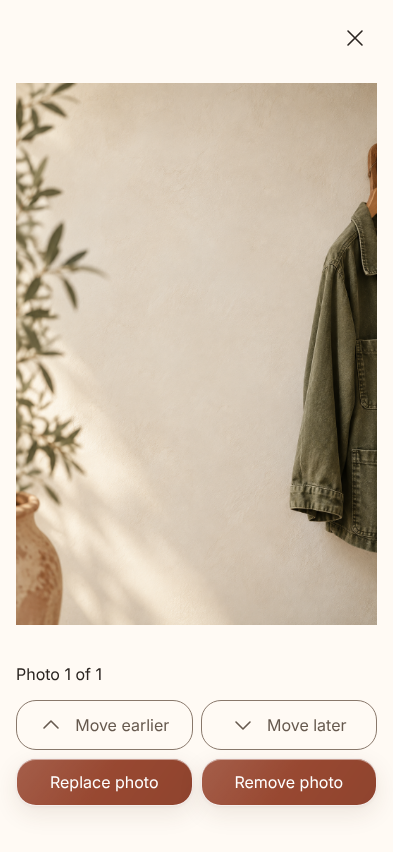</a> | <a href="./docs/screens/photo-inspection-dark.png">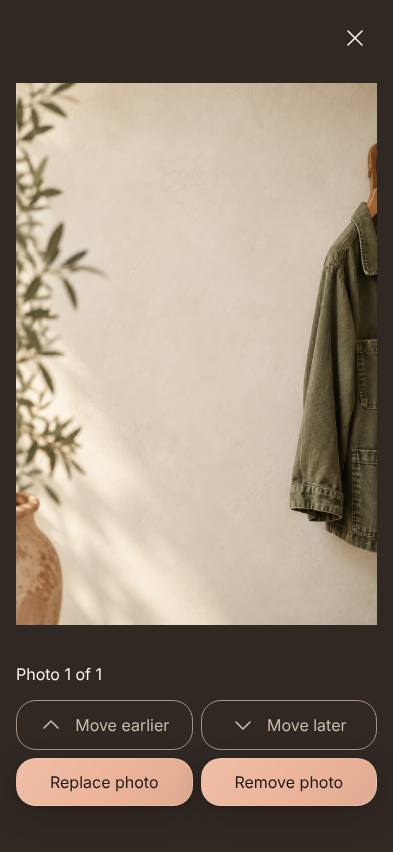</a> |

The action area contains `Move earlier`, `Move later`, `Replace photo` and `Remove photo`. Move earlier is unavailable for the first image; Move later is unavailable for the last. Reordering updates position immediately. Replace photo opens the native file picker and preserves the current position when the upload finishes. Remove photo closes inspection and updates the grid. Close or Escape returns to the item without discarding context or other photos.

These actions belong to inspection, rather than a separate edit-photo route. The interface does not apply colour filters or claim image-editing tools that are not present.

## Your account

**Current — dialog opened by the photo-entry avatar.**

| Light | Dark |
| --- | --- |
| <a href="./docs/screens/account-light.png">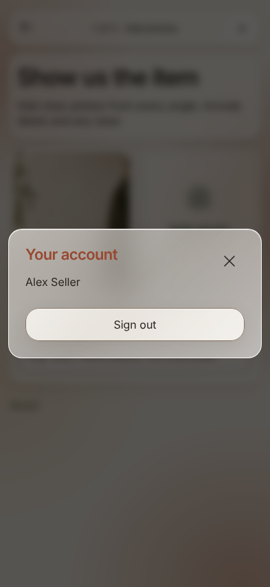</a> | <a href="./docs/screens/account-dark.png">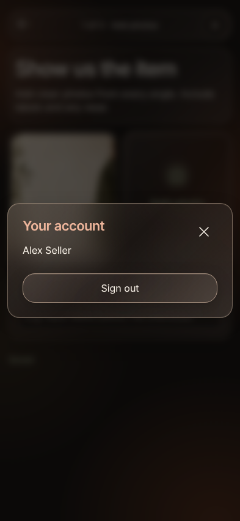</a> |

The dialog shows `Your account`, the signed-in display name, `Sign out` and `Close account`. Closing it returns to the same item. Signing out hides the item's content and displays sign-in at the same URL; access after the next sign-in is checked for that account. It is an account dialog, not a settings screen: the app has no manual appearance selector or account-editing form.

## Native Google and camera handoffs

These are necessary parts of the journey, but their chrome is controlled by the provider, browser or phone. Do not reproduce a fake system status bar, Google account selector, photo library or camera inside Vintage. Their exact layout can vary between phones and browsers.

| Handoff | Trigger | Successful return | Cancel or unavailable |
| --- | --- | --- | --- |
| Google account selection | Continue with Google | Authenticated Your listings or the originally requested item | Return to sign-in; explain cancellation, a blocked popup or a connection failure and allow retry |
| File/photo-library picker | Add photo | Retain selected files and show their tiles in photo entry | Leave the item unchanged |
| Camera/capture picker | Use camera | Retain the captured image and return to photo entry | Leave the item unchanged; Add photo remains available if the browser cannot offer camera capture |
| Replacement picker | Replace photo in inspection | Keep the target position and upload the selected replacement | Keep the original photo; closing the picker must not remove it |

## Item unavailable

**Current — `/listings/{id}` when the requested item is not available to the signed-in account.**

| Light | Dark |
| --- | --- |
| <a href="./docs/screens/item-unavailable-light.png">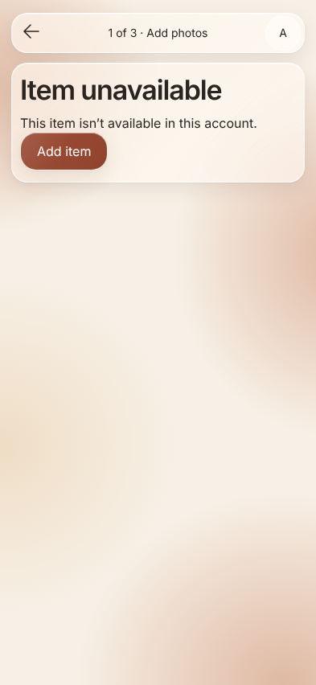</a> | <a href="./docs/screens/item-unavailable-dark.png">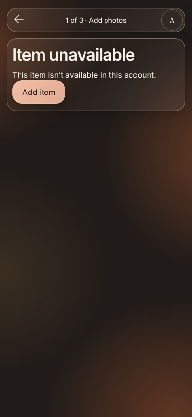</a> |

Keep the photo-flow header, back navigation and account action. Show `Item unavailable`, `This item isn’t available in this account.` and `Add item`. Back returns to Your listings; Add item opens a new photo-first item. Do not disclose another account's item details or imply that the user should rename an item to recover access. A fetch/connection failure is a recoverable error, not proof that the item is missing.

## Unknown URL and application errors

**Current — unmatched routes.** A URL outside the application's routes displays the framework's `404` / `Not Found` page. It is different from an existing listing route whose item is unavailable.

| Light | Dark |
| --- | --- |
| <a href="./docs/screens/not-found-light.png"></a> | <a href="./docs/screens/not-found-dark.png"></a> |

The current page has no in-app recovery action; browser Back or opening `/` returns to the application. A designed route-error screen with a Your listings/sign-in return action is still needed. Unrecoverable application failures similarly need a concise error and safe reload/return action without exposing internal diagnostics or claiming that local changes were lost. These are outstanding error-screen design requirements, not implemented controls in the capture.

## Shared loading, sync and error states

Loading and recovery normally stay inside the affected page or tile. They are not extra onboarding screens and must not replace the item with a full-screen network spinner while the seller is editing.

| State | Presentation | Available recovery/navigation |
| --- | --- | --- |
| Initial protected-route restoration | `Restoring your account…` | Resolve the local auth state before revealing account content |
| Opening an item | `Opening your item…` during local creation/restoration | A failed open offers Try again; a new item obtains its durable URL without a server round trip |
| Signing in | `Connecting…` or `Signing in…` in the Google control | Keep the control in place; cancellation/blocking/connection errors return it to a retryable state |
| Local edits awaiting acknowledgement | `Saving…`; input retains the seller's text | Continue editing or navigate; synchronize in the background |
| Photo selected, preparing or uploading | Local thumbnail when readable, `Waiting to upload` or `Uploading N%` and progress | Continue editing or navigate; other selections remain available within the photo limit |
| Fully synchronized | `Saved` beneath the input | Continue editing, inspect photos or return to listings |
| File validation/upload failure | Error on the affected tile, Try again and Remove; aggregate attention message | Retry that selection or remove it without losing the other photos or context |
| Stored thumbnail read failure | `Photo could not load. Try again` on that tile | Retry the read while keeping the rest of the item usable |
| Local retention failure | Explain that the selection/details could not be saved on this device | Retain the visible editable state where possible, offer retry or reselection; do not claim cloud confirmation |
| Rejected synchronization | Inline sync error; Try again and, when available, Discard unsaved change | Keep editing; discarding affects rejected local changes, not the saved item itself |
| Event/projection problem | `Some changes could not be displayed.` | Preserve recoverable item content and do not present an invented successful state |

### Upload error example

| Light | Dark |
| --- | --- |
| <a href="./docs/screens/upload-error-light.png">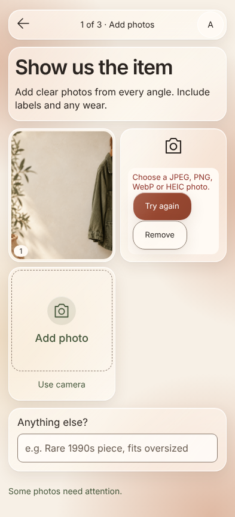</a> | <a href="./docs/screens/upload-error-dark.png">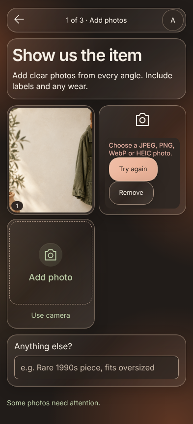</a> |

The capture uses an unsupported text file to exercise the actual upload-error UI. File type/size failures require a valid replacement selection; retry alone cannot make an invalid file valid.

### Locally retained work without connectivity

| Light | Dark |
| --- | --- |
| <a href="./docs/screens/offline-edits-light.png">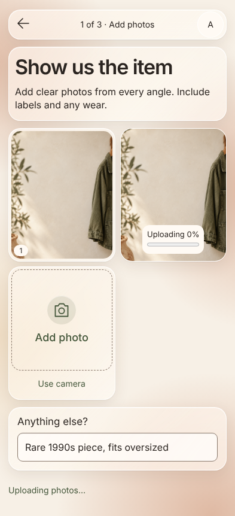</a> | <a href="./docs/screens/offline-edits-dark.png">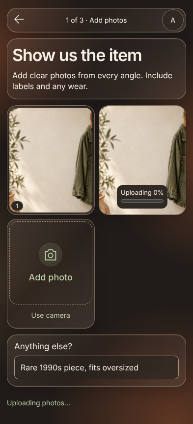</a> |

This capture shows a second photo and context retained while the browser is disconnected. The current UI uses the pending/upload indicators above rather than a dedicated offline page. Connectivity loss does not disable Back, New listing or Anything else?. On reconnection, pending writes and uploads resume. After tab closure, reopening the item recovers selected bytes retained on that device; if device storage has been cleared, the seller must reselect missing files. Do not instruct the seller to clear site data as routine recovery for a stale preview.

## Seller examples

**Planned — milestone 4.** This screen supplies the source material for personalized writing and pricing. It needs an empty state asking for examples, a review of the supplied material, validation errors, duplicate/replacement handling and an action to start learning.

Before implementation, agree the input source and entry interaction, its limits, and where it is opened from the listing journey. No source picker, import route or dedicated visual is approved by this document yet. Google identity must not be described as automatically providing marketplace history. With no examples, ask for them; a generic-draft option needs the separate product decision identified in the implementation plan and must never claim to use the seller's established style.

## Learning progress

**Planned — after examples are submitted.** This is distinct from Google authentication and from item-draft generation.

Show the actual examples received and analyzed, the current learning step, and completion or a recoverable error. Counts and completion come from persisted work, not timed animation. The seller can leave and return without restarting completed work. Retry must continue or safely repeat the failed operation. On completion, return to photo entry for the item being prepared. Previously selected photos and context survive the learning flow. A source-specific mockup is still needed once the example-input interaction is agreed.

## Build the draft

**Planned.** No generation-progress screen is currently exposed.

| Light | Dark |
| --- | --- |
| <a href="./docs/mockups/03-building-draft-light.png"></a> | <a href="./docs/mockups/03-building-draft-dark.png"></a> |

Purpose: make useful work and progress legible while Vintage produces the proposal.

The stage list corresponds to durable generation events:

1. Reading the photos
2. Matching the seller's listing style
3. Comparing the market
4. Building the price strategy

Completed stages remain checked after refresh because the screen is a projection of the listing event stream. The active stage is announced through an `aria-live="polite"` status region. The seller can leave the screen and return while processing continues.

The market message reinforces the pricing objective: determine the item's best market position using the complete relevant price distribution, item differentiation, demand, and negotiation room.

## Review, edit, and approve

**Planned.** The current app stops at photo entry; these controls become available with real proposal generation.

| Light | Dark |
| --- | --- |
| <a href="./docs/mockups/04-review-light.png"></a> | <a href="./docs/mockups/04-review-dark.png"></a> |

Purpose: let the seller evaluate one coherent proposal and approve it confidently.

The review is a single scrollable form with two clear sections.

### Listing proposal

- Ordered photos
- Editable title
- Editable category, brand, size, colour, material, condition, and other attributes
- Editable description
- Visible markers for inferred fields and uncertain observations
- A `Written in your style` explanation showing which recurring seller patterns shaped the draft

Edits save as the seller works. Field-level undo restores the latest AI proposal. Vintage records the difference between generated and approved content as learning evidence for later drafts.

### Pricing proposal

The recommended listing price is the visual anchor. It is accompanied by:

- an expected sale-price range;
- the relationship between price, expected revenue, and time to sale;
- a seller-adjustable price control;
- evidence supporting premium positioning;
- relevant comparable groups and their price distributions; and
- room reserved for likely offers.

Selecting an evidence row opens a bottom sheet with the underlying comparable group, why it is relevant, its condition and attributes, and its contribution to the recommendation. Changing the price updates the expected range and sale-speed estimate.

`Approve listing` commits the current title, attributes, description, photo order, and chosen price as one approved proposal.

## Evidence details

**Planned — bottom sheet opened from a review evidence row.** This is a separate interaction surface even though it does not need a new route.

Show the selected evidence's title, relevance to the item, source references and the observation supporting the proposal. Market evidence includes comparable groups, condition/attributes, price distribution, currency and freshness. Distinguish asking prices, observed sales and modeled estimates. Photo or seller-style evidence identifies its corresponding source instead of fabricating a market comparison.

The sheet has a visible close action and supports Escape. Closing restores the review scroll position, edited values, selected price and focus on the invoking row. Long evidence scrolls inside the sheet. Missing evidence or a failed fetch is explained in place with retry where applicable; it must not erase review edits or display invented comparables. A dedicated light/dark evidence-sheet mockup remains part of the planned review work.

## Approval confirmation and approved listing

**Planned.** This is a distinct success/read-only state of the review flow, not a current route.

Approval resolves to a compact success state within the review screen. It shows the approved price, confirms that the listing is ready, and provides a primary `Copy listing` action. The approved result remains available from Your listings as an immutable approved snapshot. Reopening it shows the approved copy and price rather than an editable draft. Copy success has visible feedback; if the clipboard is unavailable, expose selectable listing text. A failed or stale approval keeps the editable proposal and explains the action needed; it must not show success before confirmation. Returning to Your listings and starting a New listing remain available.

## Visual language

The interface uses a terracotta and linen palette with glassmorphic surfaces in both light and dark appearances. Translucent, softly blurred cards sit over restrained terracotta and sand background gradients, with fine edge highlights and subtle shadows. Text, icons, photos, and essential controls remain crisp and opaque.

| Element | Light appearance | Dark appearance |
| --- | --- | --- |
| Canvas | Linen `#F7F0E6` with pale sand and terracotta gradients | Warm charcoal `#211C19` with muted clay and umber glows |
| Glass surfaces | Frosted translucent linen-white | Frosted translucent warm charcoal |
| Text | Warm charcoal `#2B2521` | Linen `#F7F0E6` |
| Primary actions | Rust `#984831` with white text | Soft apricot `#EDB59B` with warm charcoal text |
| Price, selection, and progress accents | Rust `#984831` | Soft apricot `#EDB59B` |
| Evidence and completion | Dark sage | Pale sage |
| Inputs and boundaries | Defined neutral edges and light fills | Visible pale edges and dark fills |

Sage remains a secondary colour for evidence and completion. Decorative glows use clay and sand; photographs retain their natural colours. Palette values are implementation targets, subject to contrast verification on the final composited surfaces.

Both appearances use generous whitespace, an 8-pixel spacing grid, rounded surfaces, highly legible sans-serif type, and item photography whose colours remain unchanged by the theme. Current typography uses self-hosted Inter Variable at 400–600 weights, with DM Serif Display for the wordmark. Use fine edge highlights and softly shaded translucent controls rather than thick opaque rims. Glass blur includes Safari support; input fills keep text readable on the composited background.

### Follow system appearance

Vintage follows the phone's light/dark system setting automatically from the first render and responds when that setting changes while the app is open. The same behavior applies on desktop. There is no separate in-app theme selection in v0.

Implementation should use the system colour-scheme preference for theme tokens and native controls, including page backgrounds, inputs, dialogs, loading states, errors, and approval confirmation. Switching appearance preserves the current route, draft, entered values, photo order, and focus, without a reload or a flash of the opposite theme.

Glass is decorative: sufficient surface opacity must keep text and control contrast readable over every background. Provide solid surface fallbacks when backdrop blur is unavailable or reduced transparency is requested. The generated mockups illustrate the visual direction; implementation must verify contrast and interaction accessibility in both appearances.

Motion communicates continuity between stages. The reduced-motion experience uses immediate state changes and static progress indicators.

## Accessibility contract

- Every control has a programmatic name and visible focus treatment.
- Touch targets are at least 44 × 44 CSS pixels.
- Text and interactive controls meet WCAG 2.2 AA contrast in both appearances, including over glass surfaces.
- Focus indicators, uncertain fields, errors, and disabled controls remain distinguishable in both appearances.
- The complete flow works with keyboard-only input.
- Validation and generation statuses are announced to assistive technology.
- Colour always has a text or icon counterpart.
- Photo order and AI uncertainty are available as text.
- Zoom and text scaling preserve action access and reading order.

## UX acceptance criteria

- A signed-in seller can open Your listings, choose New listing and reach photo entry without entering a name.
- Empty and populated listing screens, photo inspection, account/sign-out, inaccessible-item recovery and native camera/file handoffs have documented entry and return paths.
- Edits and selected photos appear locally without waiting for network acknowledgement; navigation remains available, and retained changes recover after reconnection.
- Cancelling a picker or closing a dialog preserves the item and returns focus to a usable control.
- A seller can provide photos and optional one-line context as the complete generation input.
- Generation progress survives reload and reports the current stage.
- The draft reflects recognizable patterns from the seller's prior listings.
- Inferred and uncertain content is easy to identify and edit.
- Pricing presents one recommendation, an expected range, and inspectable evidence.
- Approval captures exactly the content and price visible to the seller.
- Every screen follows the system light/dark appearance on first render and when the setting changes, preserving the current draft and focus.
- Both appearances have readable solid-surface fallbacks and are covered by phone and desktop visual checks.
