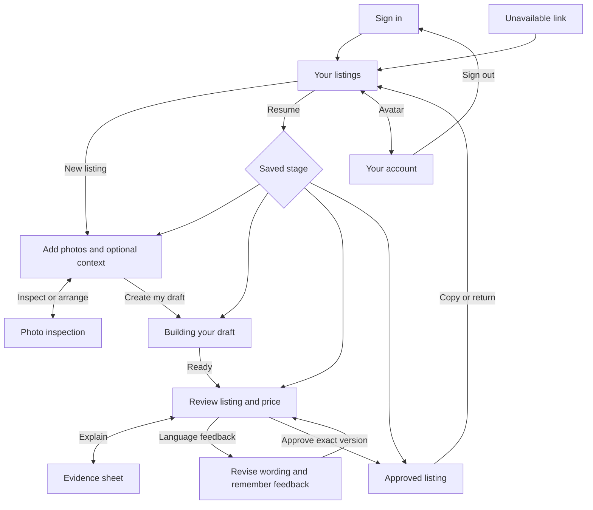
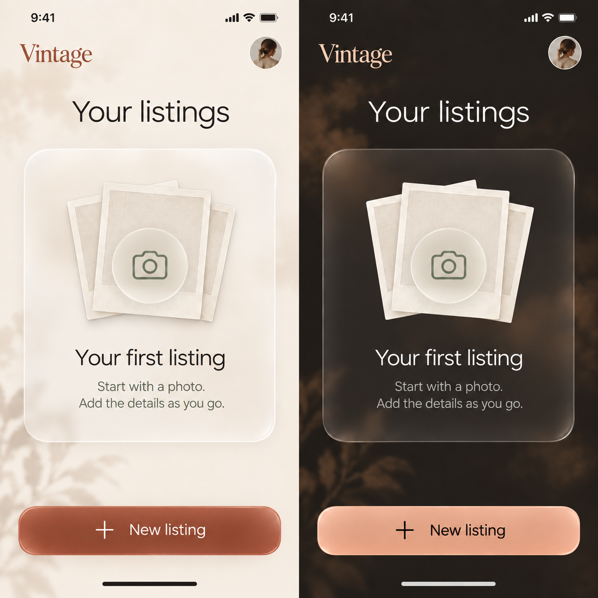
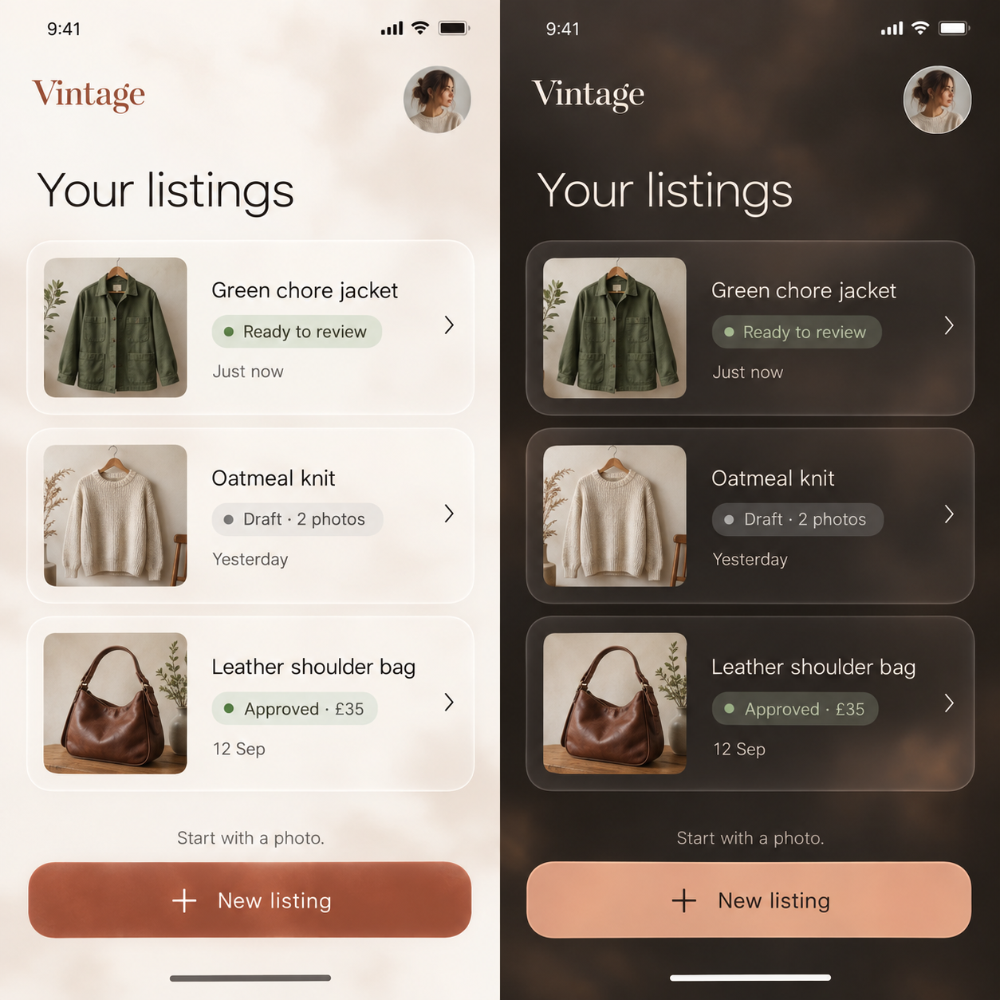
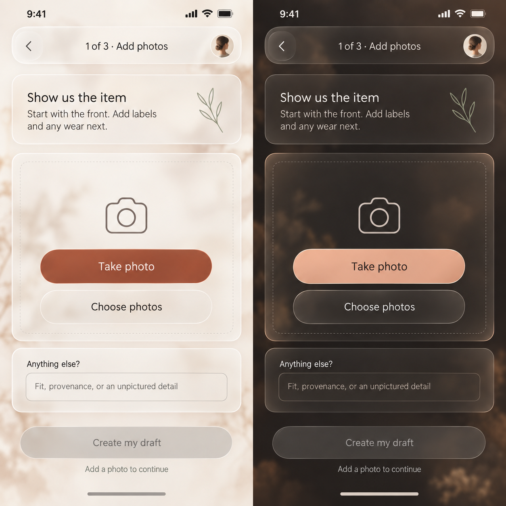
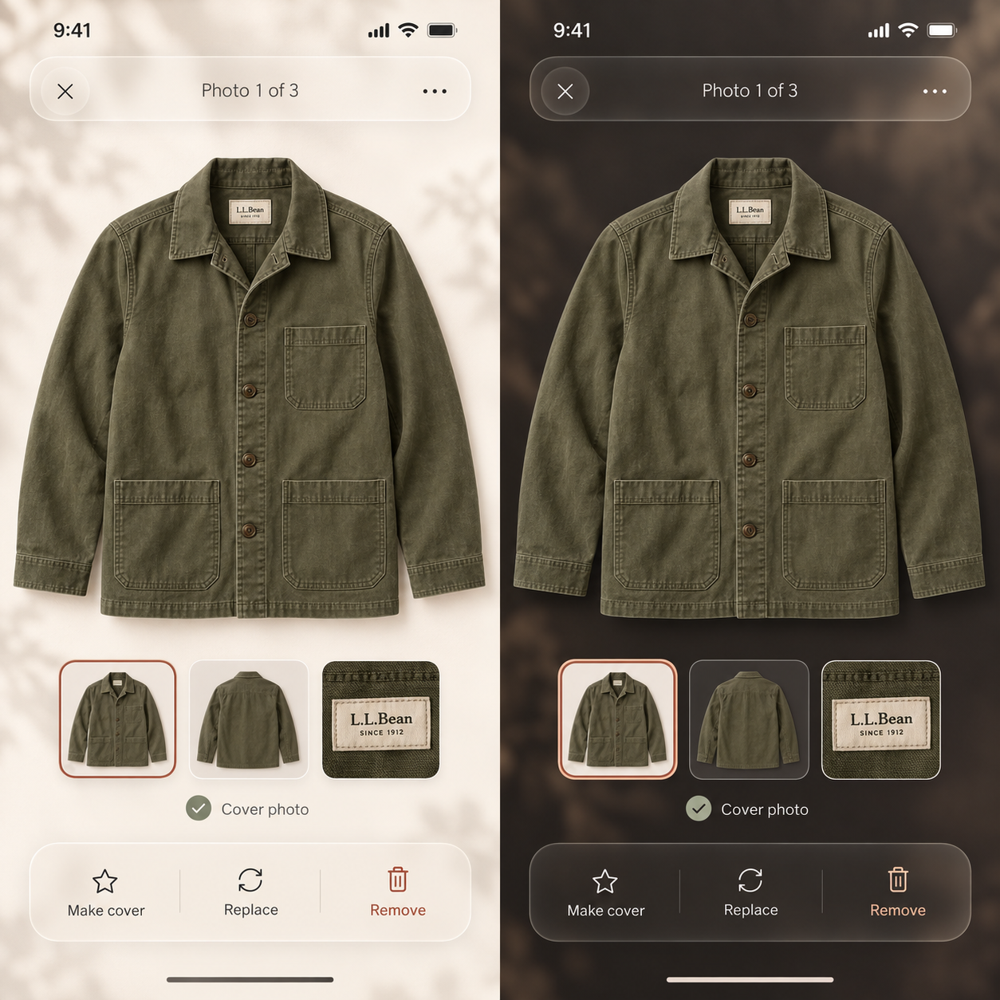
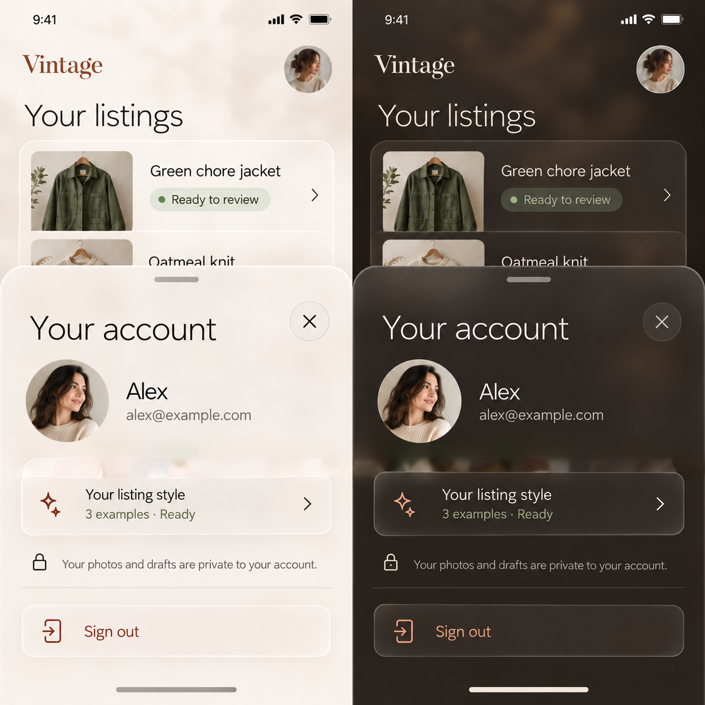
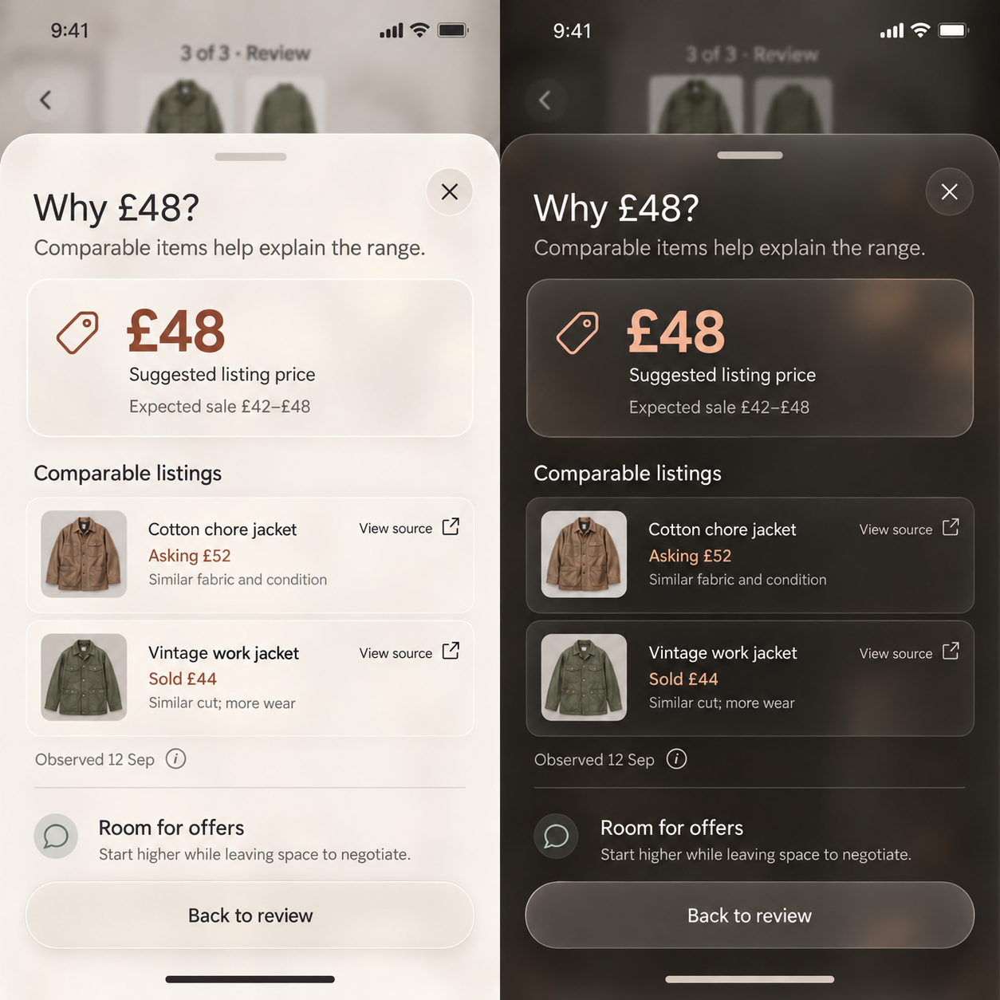
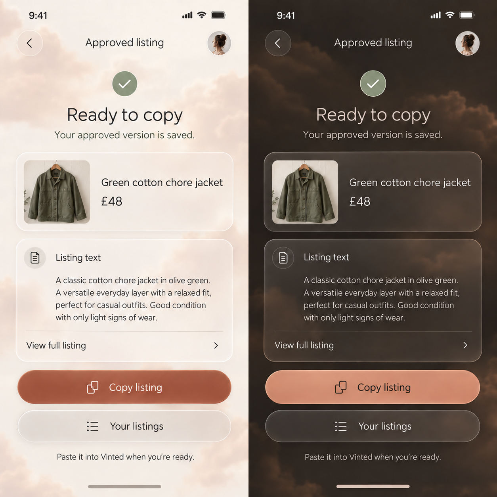
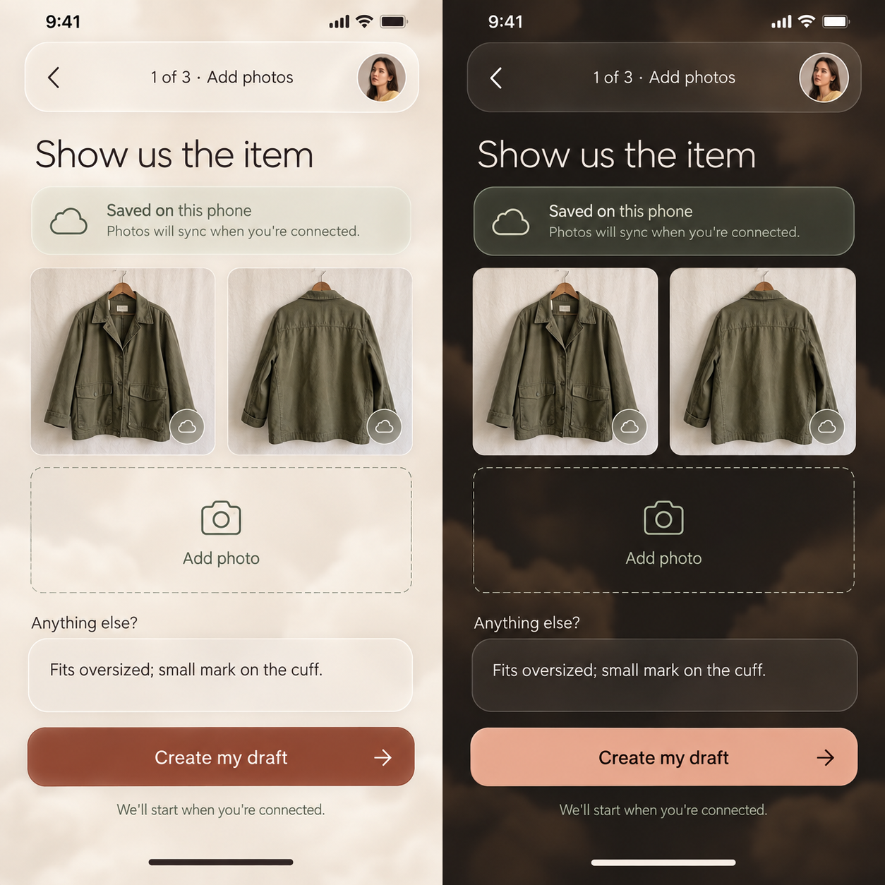
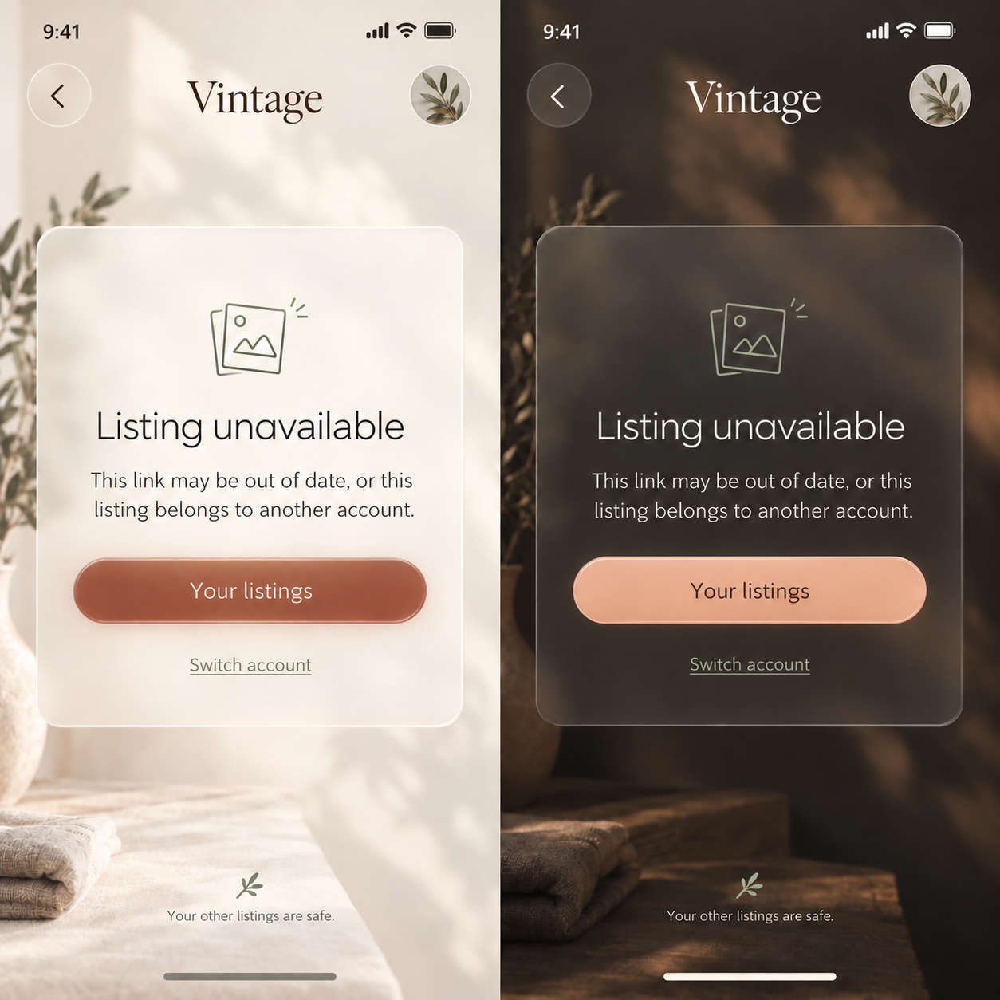

# Vintage UX design

Vintage helps a seller turn item photos into a listing that sounds like them, understand its price, and approve it with confidence. This document specifies the experience we want to build. The generated concepts establish the visual direction; the interaction requirements below specify behavior that a still image cannot show.

The terracotta-and-linen sign-in, photo, generation and review concepts remain the approved foundation. The additional concepts in this revision are proposed extensions for review. Implementation progress belongs in [IMPLEMENTATION_PLAN.md](./IMPLEMENTATION_PLAN.md).

## The experience

**Start easily.** After sign-in, Your listings is a quiet home for the seller's work. New listing opens photo entry immediately. There is no naming form or setup tour between the seller and their first photo.

**Recognize your work.** Item photographs anchor listing cards, editing and review. The seller can tell what each item needs and return to it without remembering a generated name or where they stopped.

**Stay in control.** Photos and edits appear immediately, with durable local intent and background synchronization. Generation and language revisions can continue while the seller navigates elsewhere. A connection problem never turns the whole app into a waiting room.

**Understand before approving.** Generated details are editable, uncertainty is visible, and evidence explains the price. Approval preserves exactly the reviewed version. The final action is copying that listing for use in Vinted.

## Journey and screen map

Account is also available from the photo and progress headers. Closing it returns to its invoking screen. Back from a supporting screen restores the item, scroll position and focus. Language feedback belongs beside the draft being reviewed, never in a prerequisite setup screen.

| Surface | Entry and main action | Return or continuation |
| --- | --- | --- |
| Sign in | Google authentication | Your listings; resume an authorized deep link when supplied |
| Your listings, empty | New listing | Photo entry |
| Your listings, populated | Resume an item or New listing | Its saved stage or photo entry |
| Photo entry, empty/populated | Take or choose photos; optional Anything else? | Create my draft; Back to Your listings |
| Photo inspection | Open a thumbnail | Close to unchanged editor position |
| Your account | Avatar | Close to invoking screen; sign out |
| Building your draft | Create my draft | Review when ready; Your listings while working |
| Review | Finished proposal or saved review | Edit, inspect evidence, approve |
| Language feedback | Review wording | Apply to this draft and remember for future listings |
| Evidence sheet | Photo, feedback or pricing evidence | Close to the exact review position |
| Approved listing | Confirmed approval or saved approved card | Copy listing; Your listings |
| Unavailable link | Unknown URL or inaccessible item | Your listings; switch account where relevant |
| Recoverable states | Offline, failed photo, failed generation or approval | In-place recovery with work retained |

Native Google authentication, camera and photo-library pickers are system-owned handoffs. Vintage designs their launch, cancellation and recovery, and does not imitate those interfaces.

## Reading the concepts

All visual references below are AI-generated design concepts. New boards place **light on the left and dark on the right**, displayed at 422 pixels total, approximately 211 pixels per screen. Click to inspect the full image. Existing individual concepts retain the same 211-pixel display width. Board proportions are illustrative; implementation uses a fluid phone layout and a centered mobile-width column on desktop.

The [original generation prompts](./docs/mockups/GENERATION.md) and [extension prompts](./docs/mockups/EXPANDED_FLOW_GENERATION.md) record provenance. Example identities, items, prices and evidence in the images are illustrative. Text requirements below govern behavior and resolve any image-rendered text ambiguity.

## 1. Sign in

| Light | Dark |
| --- | --- |
|  |  |

Keep the approved restrained brand composition, natural garment imagery, neutral Google control and privacy reassurance. This is the one introductory surface; working screens use short task copy.

Google signs the seller into Vintage. It does not grant access to their Vinted history. Language preferences come from feedback the seller gives while reviewing drafts. Cancelling authentication leaves sign-in usable. Failure appears beside the action with **Try again**, without discarding the destination of an item link. Show a quiet authentication indicator while resolving a session, not a flash of another user's listings.

## 2. Your listings

### First visit

One calm empty card says **Your first listing** and **Start with a photo. Add the details as you go.** The primary **New listing** action creates local draft intent and opens photo entry immediately. Account stays available. No sample listings, statistics or required title.

### Returning to work

Each generous glass card has a cover photo, a short title when available, a plain-language stage and a last-edited time. Before a title exists, use **Untitled item** with its actual photo and photo count. Never invent an AI identification before analysis. Stages are **Draft**, **Creating draft**, **Ready to review**, **Approval pending** and **Approved**. Add a small local-only indicator when an item has not synced.

The entire card resumes its actual stage. Keep **New listing** prominent near the bottom safe area without obscuring the final card. A long list scrolls naturally. An empty device awaiting its first fetch shows gentle card placeholders; cached listings remain immediately usable during refresh. An error loading additional work appears inline with retry, alongside the available items.

## 3. Photo entry

### Before the first photo

The first meaningful action is **Take photo**, with **Choose photos** alongside it as a secondary option. **Anything else?** is optional and appears beneath the capture surface. It accepts fit, provenance, fabric feel or an unpictured detail; it is never a listing-name field. **Create my draft** explains **Add a photo to continue** while there are no usable images.

### Building a useful photo set

| Light | Dark |
| --- | --- |
|  |  |

After selection, show the local photo immediately in the two-column grid and retain an **Add photo** tile. Keep the item central, with short guidance to include the front, back, labels and wear. Grid thumbnails may crop to fit; inspection always reveals the whole image. The first photo is the cover. Reordering changes that order locally and syncs in the background.

Tapping **Create my draft** records the request immediately. If files are still syncing, show **Waiting for photos to sync** with **Keep editing** and **Your listings** available. The request must identify the input version it will use; later edits are retained separately and clearly identified as changes for a subsequent draft. No repeat tap creates duplicate work.

There is no style-readiness gate or required example submission. Create the first draft directly from the photos and optional context, using any previously saved language feedback.

## 4. Photo inspection and arrangement

Give the garment most of the screen. Use a small translucent header, an untinted full image, a thumbnail strip and a compact glass action bar. Support pinch zoom and explicit previous/next controls; announce **Photo 1 of 3** and which photo is the cover.

**Make cover** moves the selected photo first. It is marked as already selected for the current cover. **Replace** launches the picker while keeping the existing photo until a replacement succeeds. **Remove** acts immediately with a reachable **Undo** message; its target is unambiguous. Removing the last photo returns to empty photo entry. Drag ordering also has accessible **Move earlier** and **Move later** alternatives in the overflow menu.

Closing preserves editor context. Cancelling a picker changes nothing. Never use a whole-screen network spinner for these actions.

## 5. Your account

A focused glass sheet contains Google identity, privacy information and **Sign out**. It has a visible close button as well as dismissal gestures. There is no appearance selector or technical connection panel.

Keep privacy reassurance inline: **Your photos and drafts are private to your account.** Approval does not publish to Vinted. This does not need another navigation destination.

Sign-out must account for local work. When work is fully synced, sign out directly. If changes exist only on this device, present **Keep working** and **Sign out** with an explicit explanation that those changes remain on this device for this account and cannot yet be opened elsewhere. Do not erase recoverable work or expose it to the next signed-in account.

## 6. Language feedback during review

Below the editable description, use an inline glass card labelled **How should it sound?**, a free-text field and **Apply feedback**. The seller can request changes to phrasing, tone or length while looking at the actual draft. Explain **Applies to this draft and future listings.** Feedback is optional; the first draft requires no setup.

Persist the instruction and exact title/description being revised locally before showing pending work. Synchronize in the background. Apply a real language revision to title and description only; retain photos, attributes and the selected price. Pin the source version and feedback so a late response cannot overwrite newer edits. Keep the original copy on failure, with retry and navigation available. Show saved feedback and let the seller remove remembered instructions; removal affects subsequent requests, not an approved snapshot.

Do not claim feedback was applied merely because it was saved. The revision must actually use it, and future generation must include the remembered instructions. No generic profile, fixed response or simulated learning stage is an acceptable implementation. Direct manual editing remains available.

The former example-entry and learning screens are removed from the product flow. Their mockups are no longer implementation references. The existing review concept supplies the glass, spacing and typography for this inline addition; it does not depict the new feedback interaction.

## 8. Building your draft

| Light | Dark |
| --- | --- |
|  |  |

Keep the photo and genuine stage visible: reading photos, applying saved language feedback, comparing the market and building the price strategy. Progress resumes from persisted operation state, with no simulated timers. **Your listings** remains available while work continues. A ready card returns the seller to review; completion must not steal focus from another task.

If generation fails, the same progress card explains **We couldn't finish this draft**, retains the item and offers **Try again** and **Back to photos**. Retry resumes or creates an explicitly new attempt without duplicating approval or losing edits. When a new proposal would replace an edited one, show **Replace proposal?** and explain which edits would be replaced before proceeding.

## 9. Review the listing and price

| Light | Dark |
| --- | --- |
|  |  |

Use one scrollable review with two clear groups: **Listing proposal** and **Recommended price**. Show ordered photos, editable title and description, and category, brand, size, colour, material and condition. Mark uncertain inferences with text such as **Check size**, linked to the relevant photo. Do not bury uncertainty in an icon or present guessed facts as confirmed.

Edits save locally as the seller types. A field-level **Restore suggestion** action returns to the generated value. Language feedback changes wording through the interaction above. Only claim personalization when saved instructions were actually used.

Price is the visual anchor, with an editable listing price, currency, expected sale range and concise rationale. Distinguish a listing price from a predicted sale price. The inherited mockup's “Faster sale / Slower sale” curve is illustrative, not a valid chart specification: an implemented chart must name its measured quantity and horizon, distinguish expected revenue from sale probability and time to sale, and use supported data. Show plain-language uncertainty or unavailable estimates when evidence cannot support a chart. Changing price retains the new value immediately and identifies dependent estimates as updating until recalculated.

**Approve listing** captures the exact reviewed title, description, attributes, photo order and chosen price. If confirmation needs network work, transition immediately to **Approval pending**, preserve an immutable view of the submitted version, and keep navigation available. Show **Approved** only after confirmation. Failure returns to a recoverable review; concurrent changes require review of the newer version rather than silently approving stale content.

## 10. Evidence details

Evidence opens in a near-full-height glass sheet above the review. Lead with the question being answered, such as **Why £48?**, followed by the observation and inspectable sources. Price evidence distinguishes **Asking**, **Sold** and modeled estimates, with currency, source links and observation dates. Explain why each comparable matters and where it differs; include higher-value matches when relevant. Values and sources pictured here are illustrative, never production fixture evidence.

Use the same sheet anatomy for photo observations and language-feedback evidence, replacing comparable rows with the actual referenced photo or instructions. Missing evidence says **Evidence unavailable** with retry when appropriate; it never invents sources. Close and Escape restore edited values, selected price, scroll position and focus on the invoking row.

## 11. Approved listing and copying

A restrained success mark, item photo and approved price confirm the result. **Ready to copy** leads to **Copy listing**, with **Your listings** as the secondary action. The approved listing is a read-only snapshot, available from its saved card after reload. **View full listing** expands the complete approved text and attributes inline; it does not open an editor.

Copy produces **Copied** feedback. If clipboard access fails, expand selectable full text with **Select listing text** and manual-copy guidance. Always let the seller inspect what is being copied. Approval never publishes automatically; **Paste it into Vinted when you're ready** explains the handoff. Starting another listing remains available from Your listings.

## 12. Offline and recovery

### Keep the item usable

Use one quiet contextual status: **Saved on this phone** and **Photos will sync when you're connected**. It appears only when useful. Once local persistence succeeds, camera, context entry, photo arrangement and navigation stay responsive. Sync resumes automatically. Do not claim cloud save, or local save before the corresponding write succeeds.

| Situation | Presentation and recovery |
| --- | --- |
| Camera or picker cancelled | Return to the editor and invoking control with no error or lost input |
| Camera unavailable or permission denied | Inline explanation with **Choose photos**; native permission settings remain system-owned |
| Unsupported or unreadable file | Error on the affected tile: **Couldn't use this photo**, with **Choose another photo** and **Remove**; retain other photos |
| Upload interrupted | Keep the local thumbnail; indicate pending sync; retry automatically and offer manual retry after persistent failure |
| Local storage cannot retain a photo or edit | Explicit **Not saved on this phone** near the affected content; retain the in-memory value and explain the risk before leaving |
| Session expired | Preserve recoverable local work and offer **Sign in again**; hide private content until the account is re-established |
| Generation or language revision failed | In-place stage error with retry and a route back to the retained input |
| Approval pending or failed | Preserve the submitted version; never display confirmed approval prematurely |
| Copy unavailable | Expand selectable approved text with manual-copy guidance |

Error messages identify the affected operation and give a useful action. No raw backend messages, technical diagnostics or whole-page replacement of an editable item.

### An unavailable link

A shared recovery layout keeps the same header, glass treatment and typography. For an inaccessible item, say **Listing unavailable** without exposing another account's data or confirming whether that item exists. Offer **Your listings** and **Switch account**. For an unknown route, use **Page unavailable**, **This link may be out of date**, and **Your listings**; omit the account-specific explanation. Signed-out visitors receive **Sign in** instead. Authentication failures and temporary fetch failures use retry before treating a link as unavailable.

## Visual and interaction system

| Element | Light | Dark |
| --- | --- | --- |
| Canvas | Linen `#F7F0E6`, restrained sand and terracotta clouds | Warm charcoal `#211C19`, muted clay and umber glow |
| Glass | Translucent linen-white, fine light edge, soft shadow | Translucent warm charcoal, pale linen edge, restrained depth |
| Text | Warm charcoal `#2B2521` | Linen `#F7F0E6` |
| Primary action | Rust `#984831`, white label | Apricot `#EDB59B`, warm charcoal label |
| Evidence and completion | Dark sage | Pale sage |
| Photos | Natural, untinted colour | The same natural, untinted colour |

Glass should be visible in controls as well as cards: soft transmitted background colour, a fine edge highlight, a restrained inner sheen and a gentle shadow. Keep labels opaque and crisp. Avoid thick rims, flat grey slabs and decorative blur behind low-contrast text. Input surfaces need enough opacity to stay readable while still belonging to the glass system.

Use a refined serif only for the Vintage wordmark, and a rounded, open modern sans for everything functional. Target regular body text, medium control labels and restrained semibold headings; avoid heavy block lettering. At phone scale start with 16px body/control text, 13–14px supporting text and 28–32px page headings, adjusting to match the concepts while preserving accessibility. Use an 8px spacing rhythm, roughly 16–24px page gutters, 20–28px panel corners, fine consistent line icons and generous internal spacing.

The app remains a focused mobile-width column on desktop, approximately 393px with room for accessibility scaling. Let content scroll, including tall forms and evidence. Keep primary actions reachable above safe areas and virtual keyboards without covering fields. In sheets, trap focus, provide a visible close action, support Escape and restore focus when dismissed. Short confirmations and errors reuse this same glass sheet system.

### System appearance and motion

Follow the device's light/dark setting on first paint and while open. There is no in-app theme switch. Every route, sheet, input, native control colour scheme, loading state and recovery state participates. A change preserves the item, entered values, photo order, route and focus without a reload or opposite-theme flash.

When transparency is reduced or backdrop blur is unavailable, use deliberately opaque surfaces with the same hierarchy and contrast. Motion communicates continuity between the photo, its inspection and review; reduced motion uses immediate changes and static progress. Neither animation nor network completion gates navigation.

## Acceptance criteria

- A new seller reaches the camera from Your listings without naming an item or completing a setup tour.
- Returning sellers recognize and resume drafts from photos and stage labels.
- Every surface in the map has a defined entry, primary action and return path in both appearances.
- Local photos and edits appear immediately; background work and reconnecting do not erase or duplicate intent.
- A first draft needs no style setup; feedback revises its language and is remembered for future drafts without blocking navigation.
- Review exposes uncertainty, real source evidence and editable copy and price.
- Approval confirms exactly the submitted version; copy and manual-copy recovery use that approved snapshot.
- System appearance changes preserve work and focus across all screens and sheets.
- Controls have accessible names and visible focus; touch targets are at least 44 × 44 CSS pixels.
- Text and controls meet WCAG 2.2 AA contrast on the final composited surfaces in both appearances.
- Keyboard access, screen-reader status announcements, photo-order alternatives, text scaling, reduced motion and reduced transparency work throughout.
- Implementation is visually reviewed against these generated concepts at phone size and in the centered desktop layout.
