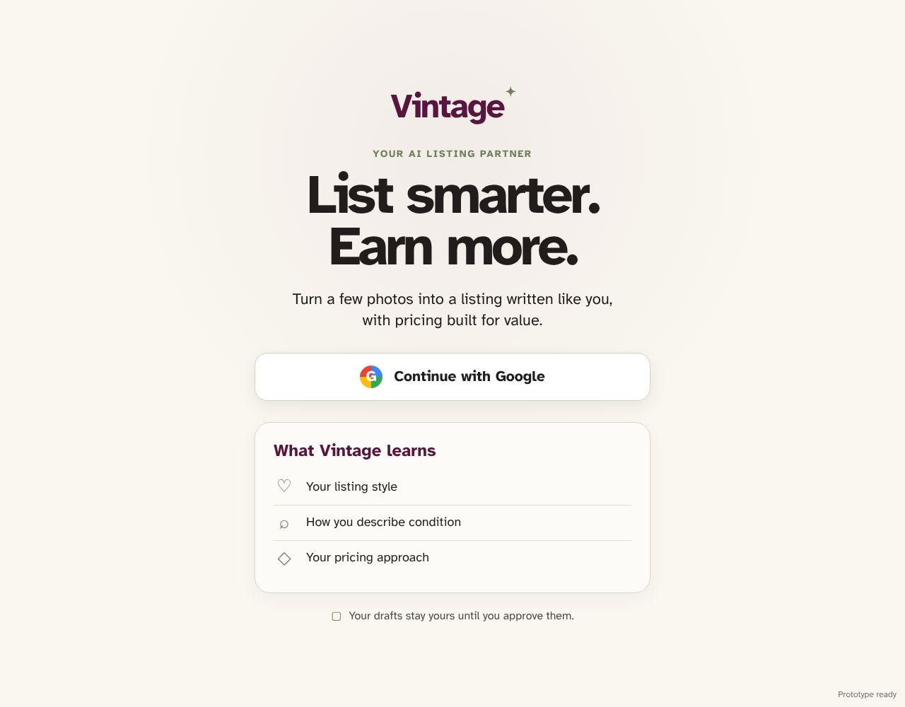

# Vintage home screen

The SPA reaches the Firebase emulator and presents the AI-first seller proposition.

## The home screen is connected and ready

**Verifications:**

- [x] The page exposes the stable Vintage title
- [x] The product promise is visible
- [x] The Google sign-in action becomes available after the emulator responds
- [x] The seller-learning promise is complete
- [x] The backend readiness status is visible
