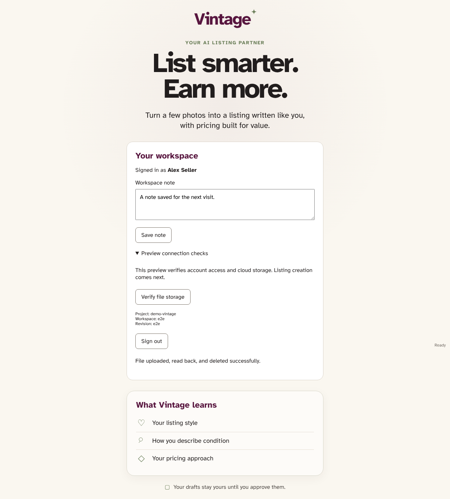

# Authenticated workspace

Google popup authentication, a persistent workspace note and an owned Storage round trip use the Firebase client SDK against local test emulators. Live preview verification is recorded separately.

## The restored account verifies persistent notes and file storage

**Verifications:**

- [x] Google session and note survive reload
- [x] An owned file is uploaded, read and cleaned up
