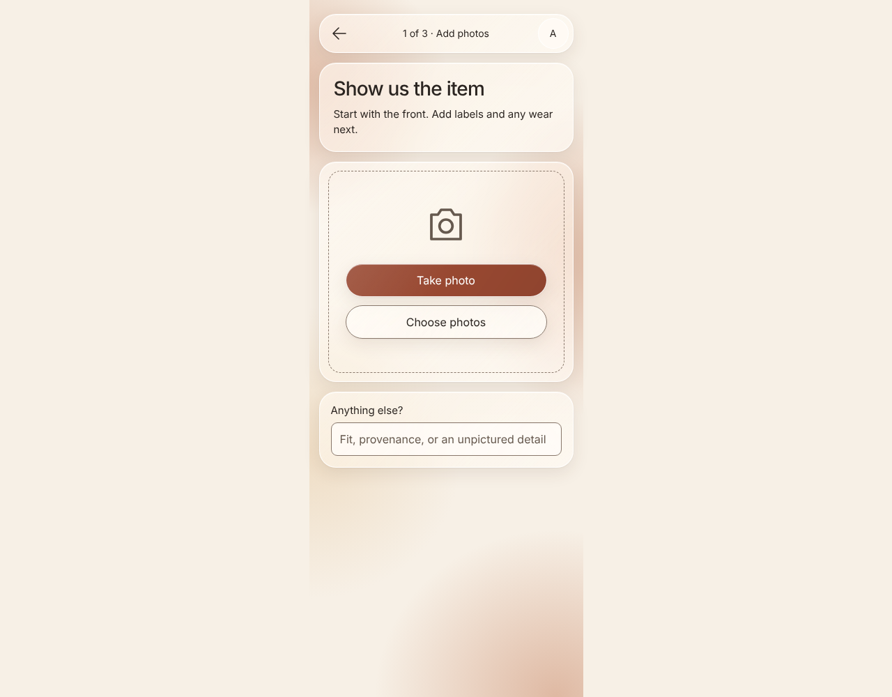
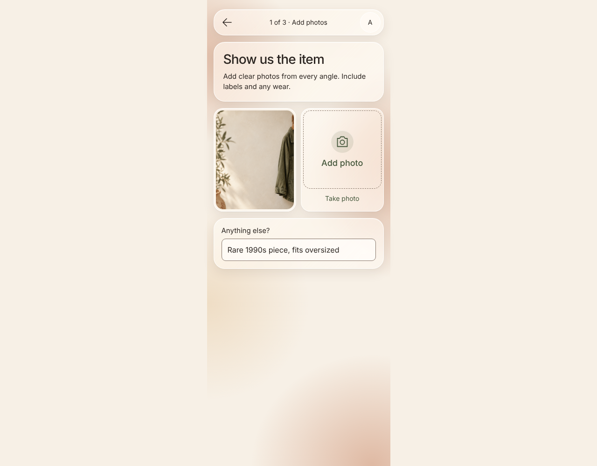
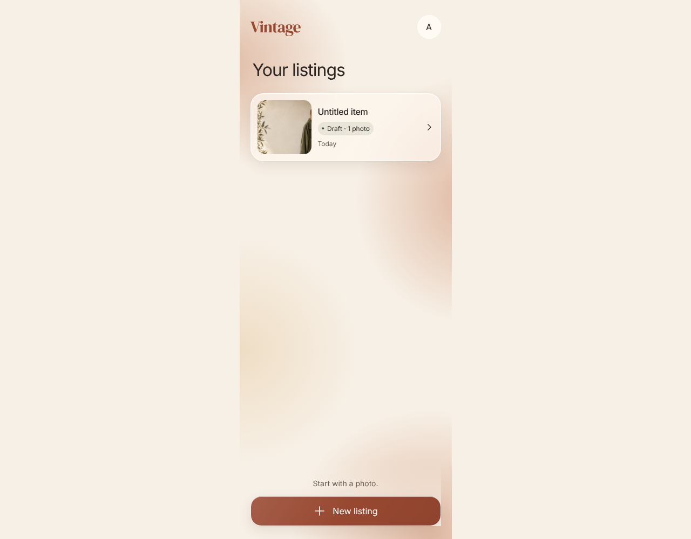
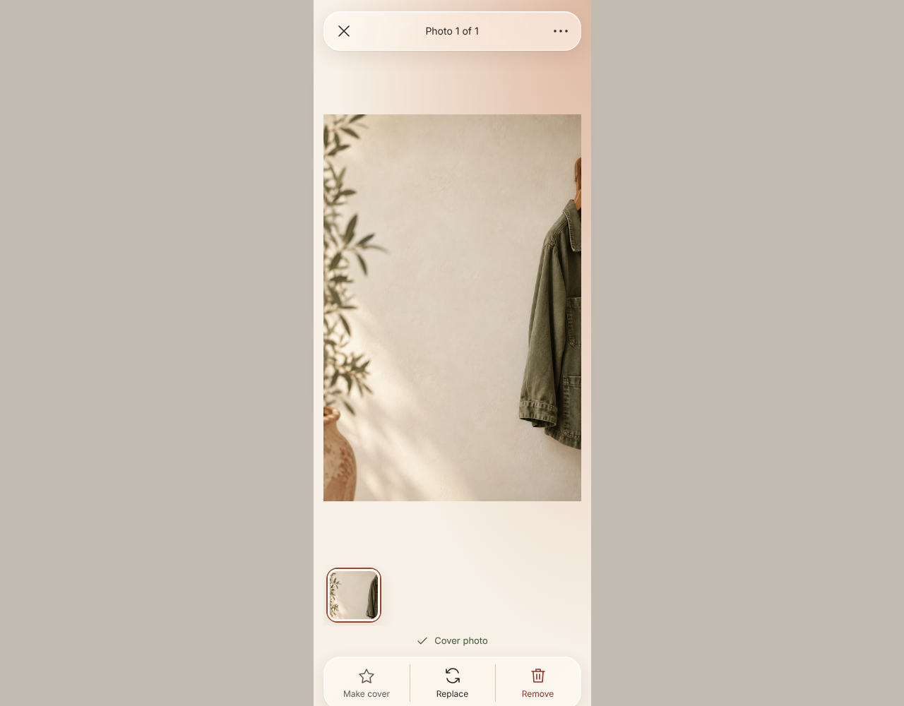
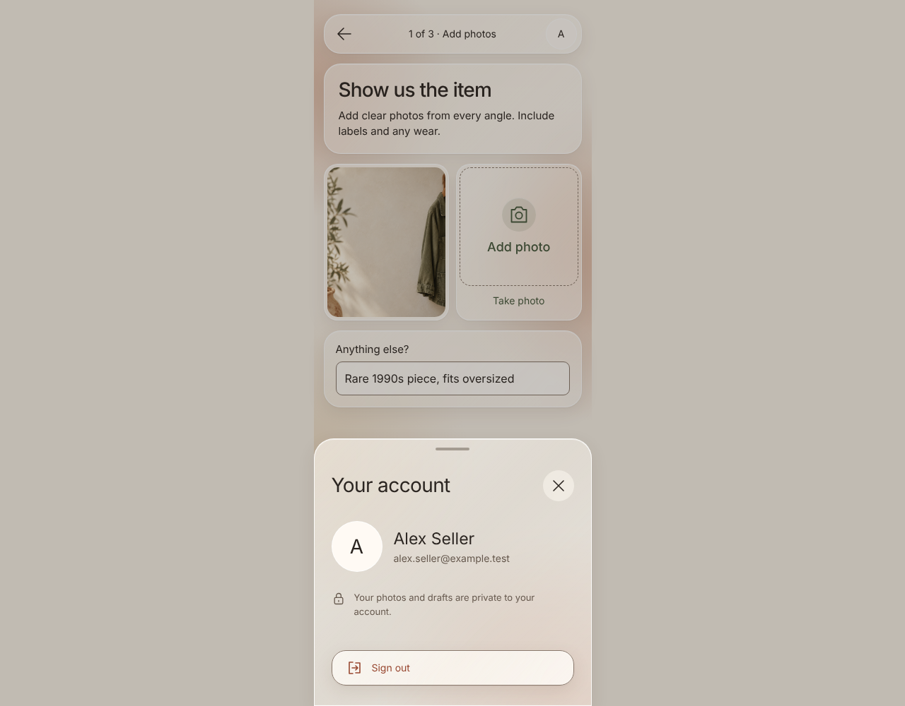
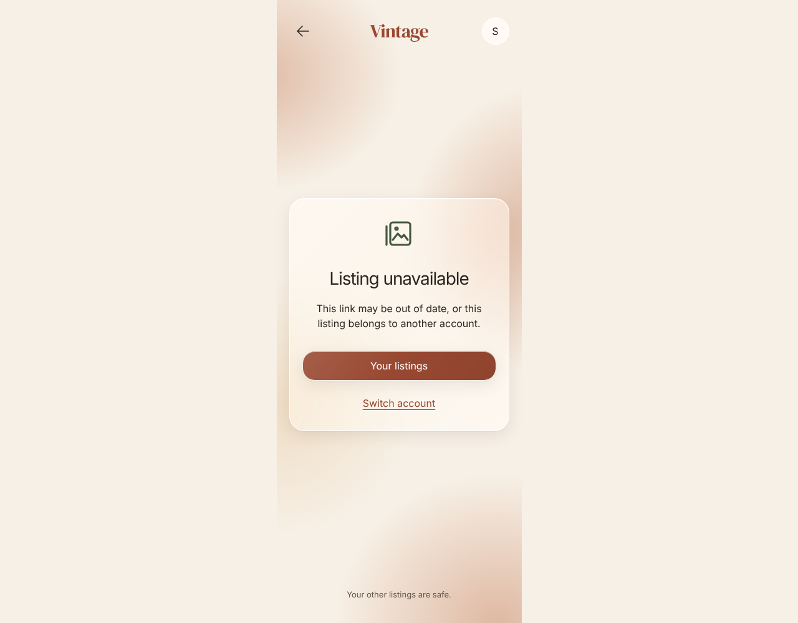

# Listings and photo entry

Start a listing with photos and optional context, persisted to the backend.

## Start a new listing without a name form

**Verifications:**

- [x] New listing opens the photo flow

## Camera-first entry with optional context

**Verifications:**

- [x] Take photo is the primary capture action

## Photo and context restored after reload

**Verifications:**

- [x] The approved step header is visible
- [x] The photo opens for inspection

## Real cover photo and photo count identify the saved draft

**Verifications:**

- [x] The draft has one photo

## Image-first inspection and compact glass controls

**Verifications:**

- [x] The first photo is identified as the cover

## Account identity and privacy in a focused sheet

**Verifications:**

- [x] The signed-in identity is visible

## An inaccessible listing has a clear return path

**Verifications:**

- [x] Switch account is offered without exposing the other item
