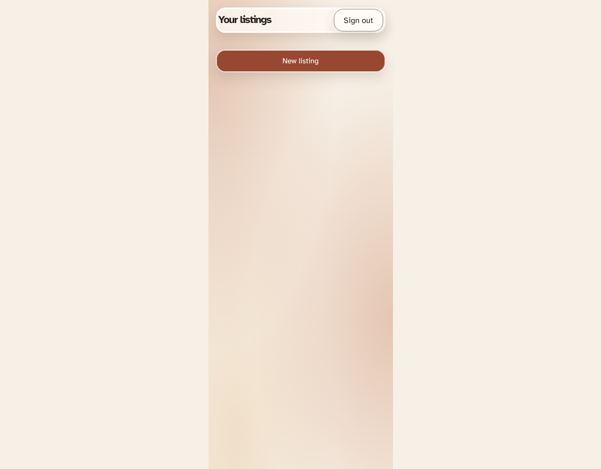

# Listings and photo entry

Start a listing with photos and optional context, persisted to the backend.

## Start a new listing without a name form

**Verifications:**

- [x] New listing opens the photo flow

## Photo and context restored after reload

**Verifications:**

- [x] The approved step header is visible
- [x] The photo opens for inspection
