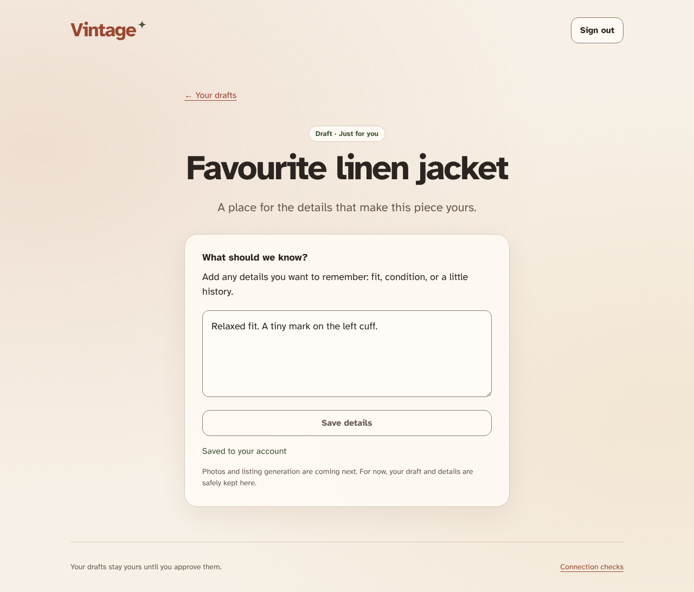

# Durable listing drafts

Create and replay a private cloud-backed draft. The same Firebase auth observer handles the emulator Google identity and live Google accounts.

## A draft and its saved details survive a direct reload

**Verifications:**

- [x] The title is reconstructed from its creation event
- [x] Details are replayed from acknowledged events
