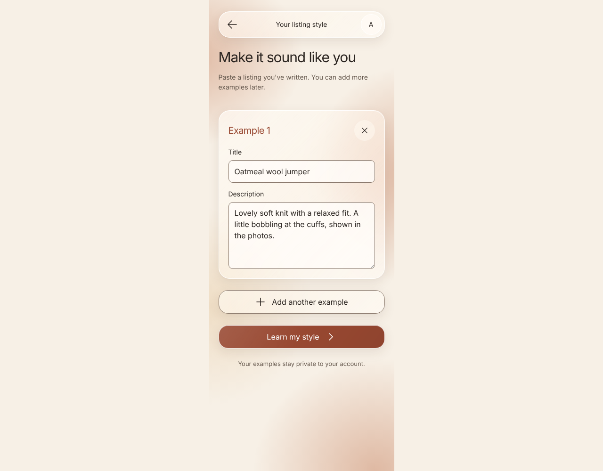
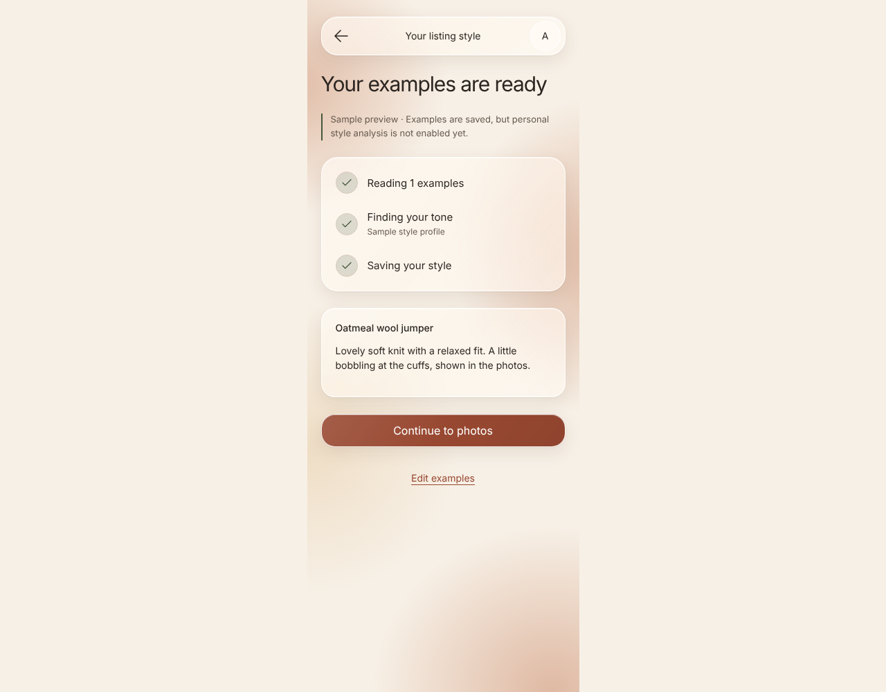
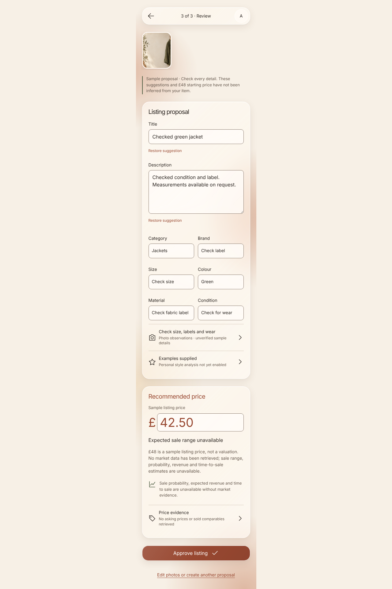
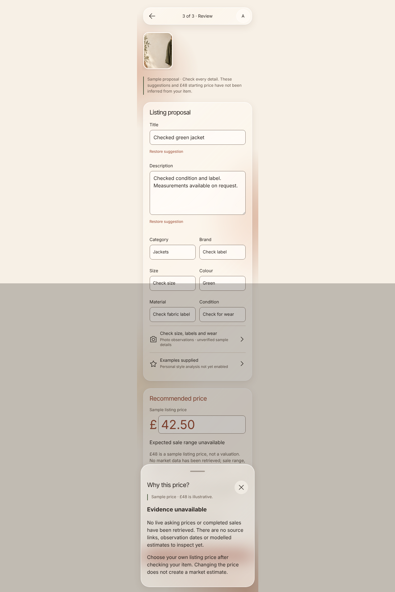
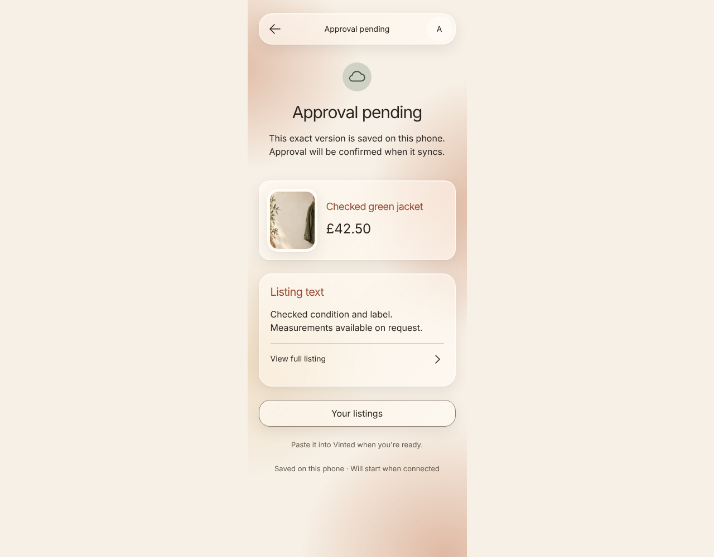
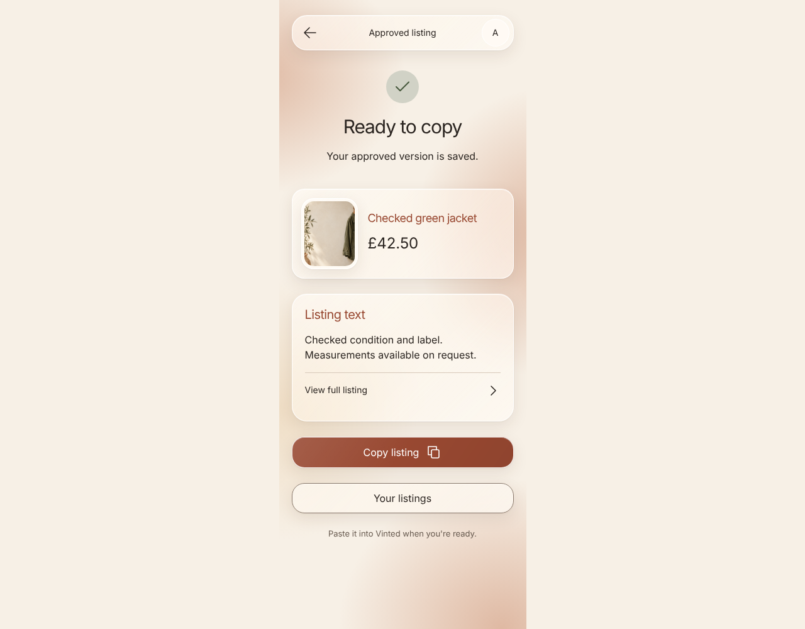

# Examples, generation and approval

A labelled sample journey backed by durable Functions and owner-scoped events.

## Paste one complete example

**Verifications:**

- [x] The original item return path is retained

## Traceable sample profile with explicit return

**Verifications:**

- [x] The seller chooses when to return to photos

## Editable proposal with honest price limitations

**Verifications:**

- [x] Sale estimates are unavailable without market evidence

## Missing market evidence is explicit

**Verifications:**

- [x] No invented comparables appear

## Offline approval preserves the immutable submitted version

**Verifications:**

- [x] Copy waits for confirmed approval

## Reload restores the approved copy and exact price

**Verifications:**

- [x] The approved version is read-only
