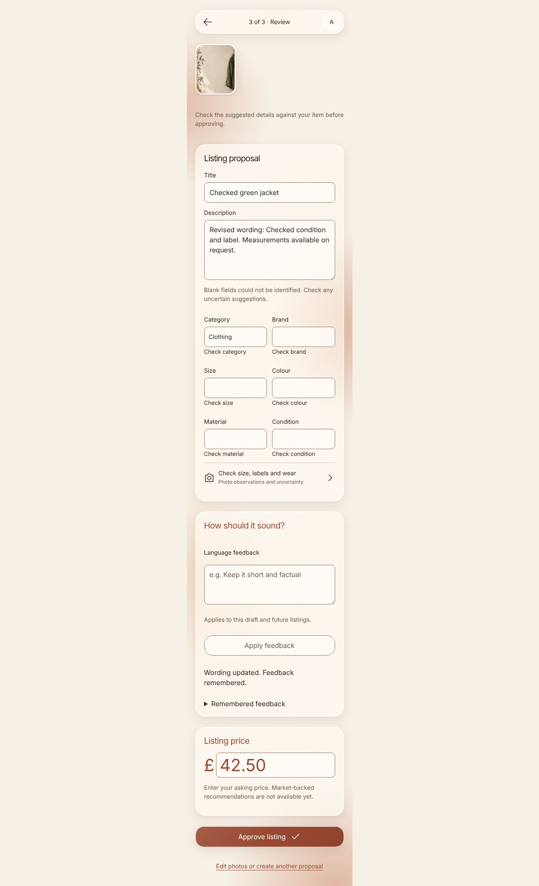
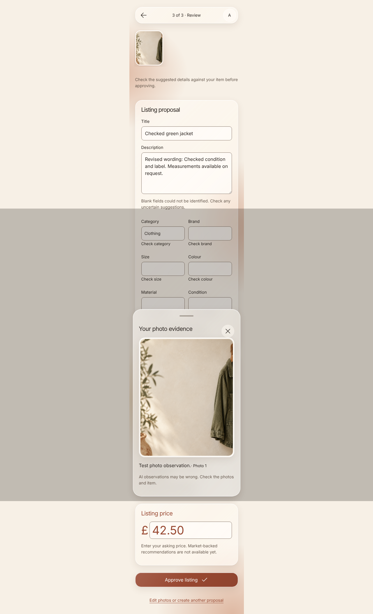
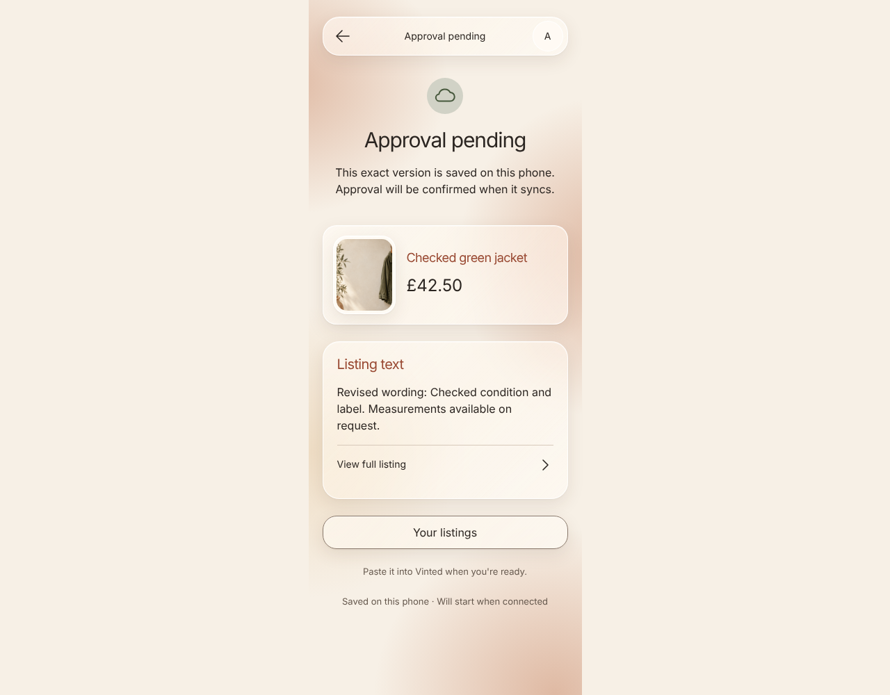
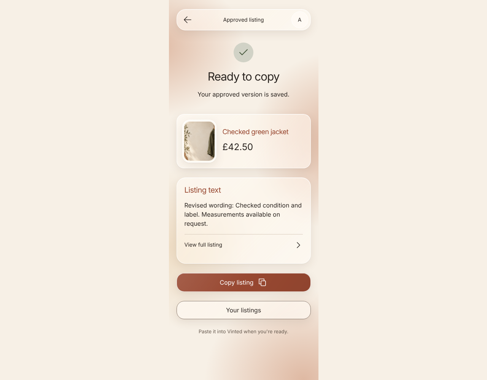

# Generation, feedback and approval

Photo-first generation with language feedback and exact approval. AI transport is isolated in the test process.

## Language feedback beside the editable draft

**Verifications:**

- [x] Feedback applies to current and future drafts

## Observations reference the supplied photo

**Verifications:**

- [x] Actual observation text is rendered

## Offline approval preserves the immutable submitted version

**Verifications:**

- [x] Copy waits for confirmed approval

## Reload restores the approved copy and exact price

**Verifications:**

- [x] The approved version is read-only
